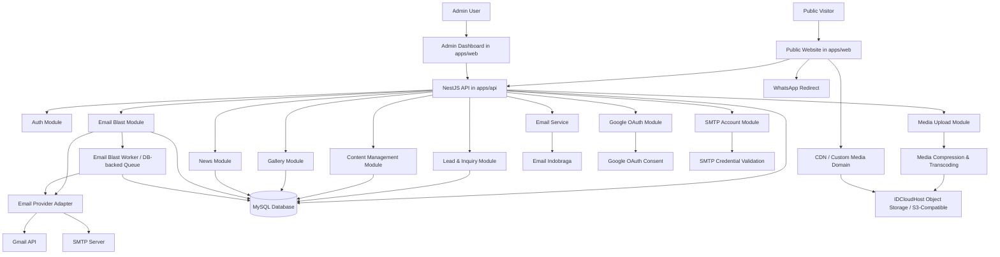
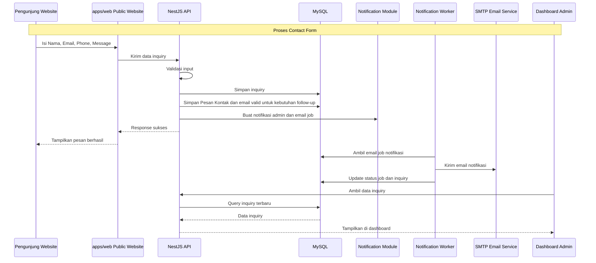
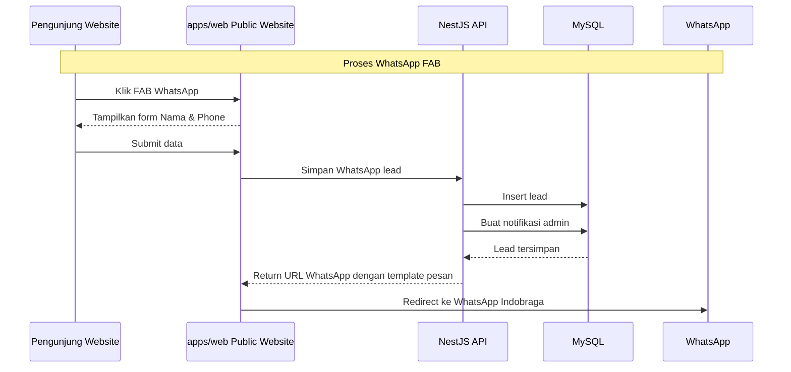
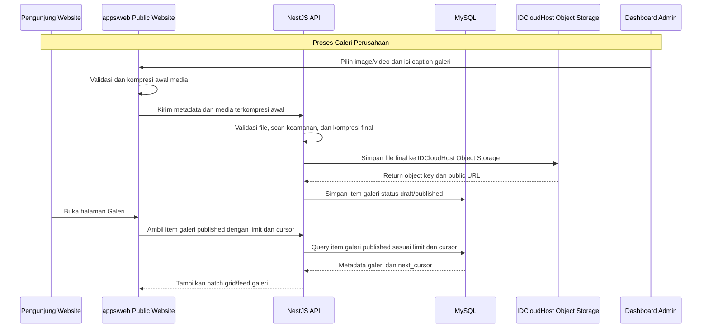
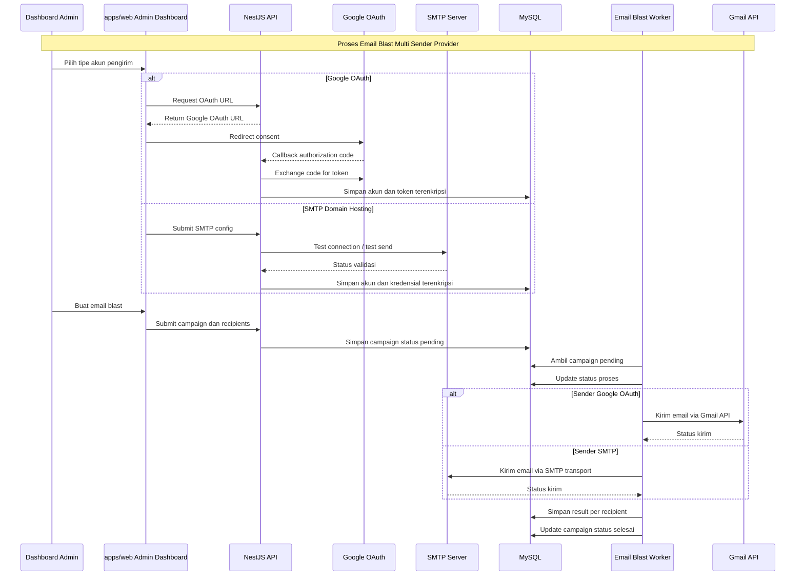
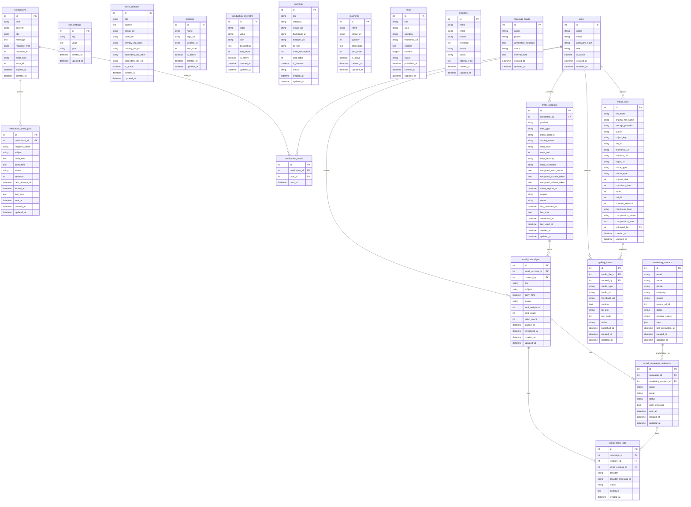

## 1. Overview

Aplikasi ini bertujuan untuk membangun **website company profile modern dan interaktif** untuk perusahaan garment dengan brand **Indobraga** dan nama legal **PT. Braga Indonesia Perkasa**. Website akan menjadi media utama untuk menampilkan kredibilitas perusahaan, kapabilitas produksi, portofolio produk garment, fasilitas mesin, galeri visual perusahaan, berita perusahaan, serta kanal konversi calon klien melalui form, email, dan WhatsApp.

Masalah utama yang ingin diselesaikan adalah kebutuhan Indobraga untuk memiliki company profile digital yang profesional, visual-heavy, ringan, dan mudah diperbarui oleh tim internal tanpa harus bergantung pada developer setiap kali ada perubahan konten.

Tujuan utama aplikasi adalah menyediakan platform berbasis web yang terdiri dari:

* **Public Website Company Profile** untuk calon klien, partner bisnis, dan pengunjung umum.
* **Dashboard Admin** untuk mengelola konten website, galeri perusahaan, berita/update perusahaan, data inquiry dari form, dan data leads dari WhatsApp.

Website harus menonjolkan positioning Indobraga sebagai perusahaan garment yang terpercaya, modern, dan siap melayani kebutuhan produksi berbagai industri, dengan salah satu pesan utama:

**“Dipercaya oleh lebih dari 250+ bisnis di berbagai industri.”**

## 2. Requirements

Berikut adalah persyaratan tingkat tinggi untuk pengembangan sistem:

* **Platform:** Sistem berbasis web dalam monorepo, terdiri dari frontend company profile, dashboard admin, dan backend API.
* **Struktur Monorepo:** Root project menggunakan folder `indobraga/`, dengan aplikasi utama `apps/web` untuk frontend public website dan dashboard admin, serta `apps/api` untuk backend NestJS.
* **Brand:** Website menggunakan brand publik **Indobraga**, dengan informasi legal perusahaan **PT. Braga Indonesia Perkasa**.
* **Target Pengguna Public Website:**

  * Calon klien bisnis yang membutuhkan jasa produksi garment.
  * Perusahaan, komunitas, brand fashion, institusi, dan industri lain yang membutuhkan produk garment custom.
  * Partner bisnis yang ingin mengenal kredibilitas Indobraga.
* **Target Pengguna Dashboard Admin:**

  * Admin internal Indobraga.
  * Tim marketing/content yang mengelola galeri, berita, dan konten website.
  * Tim sales/customer service yang memantau inquiry masuk.
* **Gaya Konten:** Company profile harus minim teks, banyak visual, modern, interaktif, dan mudah dipahami.
* **Frontend Non Developer-Centric:** Public website dan dashboard admin harus dirancang untuk pengguna bisnis non-teknis. Bahasa, label, navigasi, form, error message, empty state, dan action button harus menggunakan istilah bisnis yang mudah dipahami oleh calon klien, admin, marketing, sales, dan customer service, bukan istilah teknis internal developer.
* **Warna Utama:** Biru, Kuning, dan Putih dengan kombinasi visual modern, bersih, profesional, dan tidak terlalu ramai.
* **Form Kontak:** Website memiliki form dengan input:

  * Nama
  * Email
  * Phone
  * Message
* **Email Handling:** Data dari form kontak tersimpan di dashboard admin, membuat notifikasi admin, dan dapat dikirim ke email resmi Indobraga melalui worker email notifikasi.
* **Email Blast Admin:** Dashboard admin memiliki fitur email blast untuk mengirim email massal terbatas dari akun pengirim yang terhubung melalui Google OAuth atau konfigurasi SMTP domain hosting, dengan penerima yang dapat berasal dari filter Pesan Kontak atau upload CSV tervalidasi.
* **Google OAuth Email Account:** Akun Gmail biasa dan email domain perusahaan yang dikelola melalui Google Workspace wajib dihubungkan menggunakan Google OAuth dan dikirim melalui Gmail API. Sistem tidak menerima input manual password atau app password untuk akun Google.
* **SMTP Email Account:** Email domain perusahaan yang dikelola oleh layanan hosting non-Google seperti Hostinger Email, cPanel mail, atau layanan SMTP domain lain dapat digunakan sebagai sender email blast melalui konfigurasi SMTP. Admin wajib mengisi SMTP host, port, security mode, username, dan password/app password dari provider.
* **Multi Sender Account:** Dashboard mendukung lebih dari satu akun pengirim email, baik akun Google OAuth maupun akun SMTP domain hosting. Admin dapat memilih akun pengirim sebelum membuat campaign email blast.
* **Email Hosting Constraint:** Google OAuth hanya berlaku untuk Gmail dan Google Workspace. Layanan email hosting yang hanya menyediakan SMTP/IMAP/POP3 tidak dapat menggunakan Google OAuth, sehingga jalur MVP untuk layanan tersebut adalah SMTP sender. MVP tidak mencakup Microsoft OAuth, IMAP inbox sync, POP3, bounce processing lanjutan, atau provider email marketing eksternal.
* **WhatsApp FAB:** Website memiliki floating action button WhatsApp. Saat diklik, muncul form singkat:

  * Nama
  * Phone
    Setelah dilanjutkan, sistem akan redirect ke WhatsApp Indobraga dengan membawa nama, nomor telepon, dan template pesan ajakan komunikasi lebih lanjut.
* **Lead Recording:** Data yang masuk melalui form kontak dan WhatsApp FAB harus terekam di dashboard admin.
* **Sumber Penerima Email:** Admin dapat memilih penerima email massal dari Pesan Kontak yang memiliki email valid atau dari file CSV dengan template resmi, preview, validasi email, dan deduplikasi sebelum campaign dibuat.
* **Galeri Perusahaan:** Website memiliki fitur galeri visual berisi image/video dan caption singkat untuk menampilkan aktivitas produksi, hasil produk, suasana fasilitas, dokumentasi event, atau materi visual perusahaan. Galeri tidak memiliki fitur sosial seperti like, love, komentar, follower, atau share counter.
* **Berita/Update Perusahaan:** Website memiliki section berita untuk update informatif seperti kerja sama baru, pembukaan cabang baru, family gathering, kegiatan internal, dan informasi perusahaan lainnya. Berita berbeda dari galeri karena memiliki format artikel, slug, isi konten, dan tanggal publikasi.
* **Konten Dinamis:** Konten company profile harus dapat dikelola dari dashboard admin, termasuk hero, portfolio, mesin, partner logo, production strength, galeri, berita, dan informasi kontak.
* **Media Dinamis:** Semua media yang diunggah dan dikelola dari dashboard admin wajib disimpan di **IDCloudHost Object Storage** yang kompatibel dengan protokol S3. Media dinamis mencakup visual hero, logo partner/client, gambar portfolio, gambar mesin/fasilitas, media galeri image/video, thumbnail berita, OG image, dan media lain yang berasal dari upload admin.
* **Media Publik Berbasis Object Storage:** Semua media visual publik seperti logo aplikasi, logo partner/client, hero, portofolio, fasilitas, galeri, berita, OG image, dan media kontak disimpan di **IDCloudHost Object Storage** dan direferensikan dari database agar dapat diganti admin. Source code hanya boleh menyimpan aset UI non-konten yang bersifat code-native seperti ikon library, CSS, atau komponen placeholder; gambar konten public tidak disimpan permanen di repository, folder public lokal, atau filesystem server aplikasi.
* **Optimasi Media Sebelum Storage:** Media dinamis wajib dikompresi sebelum disimpan permanen ke IDCloudHost Object Storage. Frontend melakukan kompresi awal untuk mengurangi ukuran upload, sedangkan backend melakukan validasi dan kompresi final sebagai sumber kebenaran sebelum file final diunggah ke storage.
* **Strategi Cache Media:** Media public yang sudah final disajikan dengan pola **IDCloudHost Object Storage -> CDN/custom media domain -> browser cache**. Media menggunakan object key/URL unik yang versioned atau hashed, sehingga file dapat diberi cache panjang tanpa perlu menyimpan gambar/video di Redis, database, atau memory aplikasi.
* **Revalidasi Otomatis Setelah Perubahan Admin:** Setelah admin menyimpan, publish, unpublish, mengganti media, atau mengubah slug/status konten, sistem otomatis memperbarui referensi media, merevalidasi cache halaman public terkait, dan memperbarui sitemap bila diperlukan. Admin tidak perlu melakukan clear cache, purge CDN, atau proses teknis manual.
* **Stack Teknologi:** Sistem dibangun dalam monorepo ideal menggunakan:

  * React dengan TypeScript untuk `apps/web`
  * TanStack Router/Vite atau tooling frontend yang digunakan pada `apps/web`
  * Tailwind CSS mengikuti versi yang digunakan pada `apps/web`
  * NestJS dengan TypeScript untuk `apps/api`
  * TypeScript lintas frontend dan backend
  * MySQL
  * IDCloudHost Object Storage sebagai media storage untuk file dinamis
* **Performa:** Website harus ringan, cepat dimuat, mobile responsive, SEO-friendly, dan optimal untuk konten visual.

## 3. Core Features

Fitur-fitur kunci yang harus ada dalam versi pertama (MVP):

1. **Public Company Profile Website**

   * Landing page modern untuk brand Indobraga.
   * Visual utama berupa image/video garment production, produk jadi, aktivitas pabrik, atau mockup produk.
   * Copywriting singkat dan kuat.
   * Navigasi public mencakup halaman utama, portfolio, fasilitas, galeri, berita, dan kontak.
   * CTA utama seperti “Konsultasi Produksi” dan “Hubungi Kami”.

2. **Hero Section**

   * Menampilkan positioning Indobraga sebagai perusahaan garment terpercaya.
   * Menggunakan kombinasi visual besar, headline singkat, dan CTA.
   * Contoh arah headline:

     * “Solusi Produksi Garment Profesional untuk Bisnis Anda”
     * “Custom Apparel, Uniform, Merchandise, dan Produksi Garment Skala Bisnis”

3. **Trusted By Section**

   * Menampilkan teks:
     **“Dipercaya oleh lebih dari 250+ bisnis di berbagai industri.”**
   * Di bawah teks terdapat logo-logo perusahaan yang pernah bekerja sama dengan Indobraga.
   * Logo dapat dikelola dari dashboard admin.
   * Logo ditampilkan dalam layout carousel/grid yang clean dan modern.

4. **Production Strength Section**

   * Menampilkan kekuatan produksi Indobraga secara visual.
   * Konten dapat berupa angka/statistik seperti:

     * Kapasitas produksi per bulan.
     * Jumlah tenaga kerja.
     * Jumlah mesin.
     * Jenis layanan produksi.
     * Coverage industri.
   * Data angka dapat dikelola dari dashboard admin.

5. **Portfolio Produk**

   * Menampilkan jenis barang garment yang pernah dibuat.
   * Contoh kategori:

     * Kaos
     * Polo shirt
     * Kemeja
     * Jaket
     * Seragam kerja
     * Wearpack
     * Hoodie
     * Merchandise apparel
     * Produk custom lainnya
   * Setiap portfolio memiliki gambar, nama produk, kategori, dan deskripsi singkat.
   * Admin dapat menambah, mengubah, menghapus, dan mengatur status publikasi portfolio.
   * Admin dapat menambahkan portfolio dalam jumlah tidak terbatas, tetapi public website tidak boleh memuat atau merender seluruh portfolio sekaligus.
   * Homepage hanya menampilkan portfolio pilihan/unggulan dalam jumlah tetap, sedangkan halaman portfolio public memakai filter kategori dan batch loading.
   * Halaman portfolio public menampilkan batch awal terbatas, direkomendasikan 8-12 item, lalu memuat batch berikutnya melalui tombol "Muat lagi" atau mekanisme cursor pagination.
   * Listing portfolio public hanya menggunakan thumbnail/medium image yang sudah dioptimasi. File image ukuran besar hanya dimuat jika sistem menambahkan halaman/detail portfolio pada fase berikutnya.

6. **Machines & Facilities Section**

   * Menampilkan mesin dan fasilitas yang dimiliki Indobraga.
   * Contoh data mesin:

     * Mesin jahit high speed
     * Mesin obras
     * Mesin overdeck
     * Mesin rantai
     * Mesin potong kain
     * Mesin press
     * Mesin bordir
     * Mesin sablon/printing jika tersedia
   * Setiap mesin memiliki gambar, nama, jumlah unit, dan keterangan singkat.
   * Data mesin dapat dikelola dari dashboard admin.

7. **Galeri Perusahaan**

   * Section atau halaman galeri untuk menampilkan dokumentasi visual perusahaan.
   * Konten galeri dapat berupa:

     * Image aktivitas produksi.
     * Image hasil produk atau sample garment.
     * Image suasana fasilitas/workshop.
     * Video pendek proses produksi.
     * Dokumentasi event, kegiatan internal, atau aktivitas perusahaan.
   * Setiap item galeri memiliki media image/video, caption singkat, thumbnail/poster untuk video, tanggal publikasi, urutan tampil, dan status publish/draft.
   * Galeri bersifat visual-first seperti feed perusahaan, tetapi bukan social media. Tidak ada like, love, komentar, follower, atau engagement action lainnya.
   * Galeri tampil di public website dan dapat dikelola melalui dashboard admin.
   * Admin dapat menambahkan item galeri dalam jumlah tidak terbatas, tetapi public website tidak boleh memuat atau merender seluruh item sekaligus.
   * Halaman galeri public menampilkan batch awal terbatas, direkomendasikan 8-16 item, lalu memuat batch berikutnya melalui tombol "Muat lagi" atau mekanisme cursor pagination.
   * Grid/feed galeri public hanya menggunakan thumbnail/poster yang sudah dioptimasi. File image ukuran besar atau video final hanya dimuat saat pengunjung membuka detail/lightbox.

8. **Company Updates / News**

   * Section berita untuk update perusahaan.
   * Konten dapat berupa:

     * Kerja sama baru.
     * Pembukaan cabang baru.
     * Family gathering.
     * Aktivitas produksi.
     * Event internal.
     * CSR atau kegiatan sosial.
     * Pencapaian perusahaan.
   * Setiap berita memiliki judul, slug, thumbnail, kategori, isi konten, tanggal publikasi, dan status publish/draft.
   * Berita tampil di public website dan dapat dikelola melalui dashboard admin.
   * Berita berbeda dari galeri karena berita adalah konten editorial berbentuk artikel, sedangkan galeri adalah konten visual singkat berbasis image/video dan caption.
   * Admin dapat menambahkan berita dalam jumlah tidak terbatas, tetapi public listing berita harus menggunakan pagination dan tidak boleh mengambil seluruh artikel sekaligus.
   * Halaman listing berita public menampilkan 6-12 artikel per halaman dengan URL pagination yang SEO-friendly.
   * Response/listing berita hanya memuat metadata ringan seperti judul, slug, thumbnail, kategori, tanggal, dan excerpt. Isi artikel penuh hanya dimuat pada halaman detail berita.

9. **Contact Form**

   * Form public dengan input:

     * Nama
     * Email
     * Phone
     * Message
   * Validasi wajib untuk nama, email, phone, dan message.
   * Setelah submit:

     * Data tersimpan ke database.
     * Sistem membuat notifikasi admin.
     * Sistem menambahkan job email notifikasi ke email resmi Indobraga jika fitur email notifikasi aktif.
     * Pengunjung mendapat feedback sukses/gagal.
   * Data inquiry dapat dilihat dari dashboard admin.

10. **WhatsApp Floating Action Button**

   * FAB WhatsApp selalu terlihat di public website.
   * Saat diklik, muncul modal/form mini berisi:

     * Nama
     * Phone
   * Setelah submit:

     * Data tersimpan sebagai WhatsApp lead.
     * Sistem membuat pesan otomatis.
     * User diarahkan ke WhatsApp Indobraga.
   * Contoh template pesan:
     “Halo Indobraga, saya [Nama]. Nomor saya [Phone]. Saya ingin berdiskusi lebih lanjut mengenai kebutuhan produksi garment.”
   * Admin dapat melihat daftar leads WhatsApp dari dashboard.

11. **Dashboard Admin**

    * Login admin menggunakan email dan password.
    * Admin dapat mengelola:

      * Konten halaman company profile.
      * Logo partner/client.
      * Production strength.
      * Portfolio produk.
      * Mesin dan fasilitas.
      * Galeri perusahaan.
      * Berita perusahaan.
      * Inquiry form kontak.
      * Leads WhatsApp.
      * Notifikasi admin untuk event operasional penting.
      * Informasi kontak perusahaan.
    * Dashboard menampilkan ringkasan:

      * Total inquiry masuk.
      * Total leads WhatsApp.
      * Total galeri publish.
      * Total berita publish.
      * Total portfolio aktif.
      * Total email blast.
      * Status email blast terbaru.
      * Inquiry terbaru.
      * Badge notifikasi belum dibaca.

12. **Content Management**

    * Konten public website bersifat dinamis dan tersimpan di database.
    * Admin dapat mengubah konten tanpa deploy ulang.
    * Setiap konten penting memiliki status aktif/nonaktif atau publish/draft.
    * Gambar/video dapat diunggah dan digunakan pada section visual website, termasuk galeri perusahaan.
    * Media yang diunggah admin diproses melalui kompresi frontend dan kompresi backend sebelum disimpan permanen ke IDCloudHost Object Storage.
    * Database hanya menyimpan metadata dan URL/object key media, bukan binary file media.

13. **Authentication & Authorization**

    * Admin wajib login sebelum mengakses dashboard.
    * Password disimpan dalam bentuk hash.
    * Token autentikasi menggunakan JWT atau mekanisme session yang aman.
    * Role minimal:

      * Super Admin
      * Admin/Content Editor

14. **Lead & Inquiry Management**

    * Semua data masuk dari contact form dan WhatsApp form tersimpan di database.
    * Admin dapat melihat detail data.
    * Admin dapat mengubah status follow-up, misalnya:

      * New
      * Contacted
      * In Progress
      * Closed
      * Spam
    * Admin dapat memberi catatan internal pada inquiry/lead.

15. **Email Blast dengan Multi Sender Provider**

    * Dashboard admin memiliki fitur email blast untuk kebutuhan komunikasi marketing atau follow-up sederhana.
    * Admin dapat menghubungkan lebih dari satu akun pengirim email.
    * Tipe akun pengirim yang masuk scope MVP:

      * Google OAuth untuk Gmail biasa dan Google Workspace custom domain.
      * SMTP domain hosting untuk Hostinger Email, cPanel mail, atau provider SMTP domain sejenis.
    * Untuk akun Google, sistem tidak menyediakan input manual password, app password, atau kredensial SMTP. Akun Google wajib menggunakan OAuth dan Gmail API.
    * Untuk akun SMTP domain hosting, admin wajib mengisi email pengirim, display name, SMTP host, port, security mode, username, dan password/app password dari provider email hosting.
    * Sistem harus melakukan test connection atau test send sebelum akun SMTP ditandai connected.
    * Kredensial SMTP yang disimpan tidak boleh pernah ditampilkan kembali ke frontend setelah tersimpan.
    * Untuk sender SMTP domain hosting, kesiapan SPF, DKIM, dan DMARC domain menjadi prasyarat operasional agar deliverability tidak bergantung hanya pada aplikasi.
    * Microsoft OAuth dan provider email marketing eksternal tidak termasuk scope MVP.
    * Admin dapat memilih akun pengirim sebelum membuat email blast.
    * Admin dapat mengisi judul campaign internal, subject email, isi email, dan memilih sumber penerima.
    * Sumber penerima MVP terdiri dari hasil filter Pesan Kontak dan upload CSV.
    * Pesan Kontak menjadi sumber utama follow-up karena berasal dari form public dan memiliki konteks kebutuhan pelanggan.
    * Upload CSV dipakai untuk daftar penerima dari luar website. UI wajib menyediakan download template CSV, upload file, preview jumlah baris, email valid, duplikat, dan email tidak valid.
    * Saat campaign dibuat dari filter Pesan Kontak atau CSV, sistem membuat snapshot ke `email_campaign_recipients` agar histori campaign tetap akurat walaupun data sumber berubah setelahnya.
    * Sistem harus melakukan deduplikasi email dan hanya memasukkan email valid sebagai penerima campaign.
    * Campaign email blast memiliki status utama:

      * Pending
      * Proses
      * Selesai
    * Sistem menyimpan history campaign, jumlah penerima, jumlah terkirim, jumlah gagal, dan detail error per penerima jika ada.
    * Pengiriman email dilakukan oleh background worker agar proses blast tidak bergantung pada durasi request HTTP.
    * Worker mengirim email melalui adapter sesuai provider akun pengirim: Gmail API untuk Google OAuth dan SMTP transport untuk akun SMTP domain hosting.
    * Sistem perlu menerapkan pembatasan laju pengiriman sederhana per akun pengirim.
    * Untuk menjaga scope tetap sederhana, MVP tidak mencakup template builder, open tracking, click tracking, scheduled campaign lanjutan, unsubscribe automation kompleks, atau segmentasi audience lanjutan di luar filter Pesan Kontak sederhana.

## 4. User Flow

Alur kerja utama pengguna pada sistem:

1. **Flow Pengunjung Melihat Company Profile**

   * Pengunjung membuka website Indobraga.
   * Sistem menampilkan hero section dengan visual garment dan CTA.
   * Pengunjung melihat informasi kepercayaan bisnis melalui section “Dipercaya oleh lebih dari 250+ bisnis di berbagai industri.”
   * Pengunjung melihat logo-logo perusahaan partner/client.
   * Pengunjung melihat kekuatan produksi, portfolio barang, mesin, fasilitas, galeri visual perusahaan, dan berita perusahaan.
   * Pengunjung memilih untuk menghubungi Indobraga melalui form kontak atau FAB WhatsApp.

2. **Flow Pengunjung Melihat Galeri**

   * Pengunjung membuka halaman atau section Galeri.
   * Sistem menampilkan batch awal grid/feed visual berisi thumbnail/poster image/video perusahaan yang sudah dipublish.
   * Jika jumlah item masih tersedia, pengunjung dapat memilih tombol "Muat lagi" untuk menampilkan batch berikutnya tanpa memuat seluruh data sekaligus.
   * Pengunjung dapat melihat caption singkat pada setiap konten.
   * Jika pengunjung memilih salah satu item, sistem baru memuat media ukuran detail dan menampilkan lightbox berisi media serta caption.
   * Galeri tidak menyediakan aksi like, love, komentar, follower, atau interaksi sosial lainnya.

3. **Flow Contact Form**

   * Pengunjung membuka section kontak.
   * Pengunjung mengisi Nama, Email, Phone, dan Message.
   * Sistem melakukan validasi input.
   * Jika valid, sistem menyimpan data inquiry ke database.
   * Sistem membuat notifikasi admin di database.
   * Sistem membuat job email notifikasi operasional jika fitur email notifikasi aktif.
   * Worker backend mengirim email notifikasi ke email Indobraga secara asynchronous.
   * Sistem menampilkan pesan bahwa inquiry berhasil dikirim.
   * Admin dapat melihat inquiry tersebut di dashboard.

4. **Flow WhatsApp FAB**

   * Pengunjung klik tombol floating WhatsApp.
   * Sistem menampilkan modal input Nama dan Phone.
   * Pengunjung mengisi data dan klik lanjutkan.
   * Sistem melakukan validasi input.
   * Jika valid, sistem menyimpan data sebagai WhatsApp lead.
   * Sistem membuat notifikasi admin di database.
   * Sistem membuat template pesan otomatis.
   * Sistem redirect ke WhatsApp Indobraga dengan pesan yang sudah terisi.
   * Admin dapat melihat data lead WhatsApp di dashboard.

5. **Flow Admin Login**

   * Admin membuka halaman dashboard.
   * Admin memasukkan email dan password.
   * Sistem melakukan validasi kredensial.
   * Jika valid, admin masuk ke dashboard.
   * Jika tidak valid, sistem menampilkan pesan error.

6. **Flow Admin Mengelola Konten**

   * Admin masuk ke dashboard.
   * Admin memilih menu konten yang ingin dikelola.
   * Admin menambah, mengubah, menghapus, atau mengatur status konten.
   * Sistem menyimpan perubahan ke database.
   * Public website menampilkan konten terbaru sesuai status aktif/publish.

7. **Flow Admin Mengelola Galeri**

   * Admin membuka menu Galeri.
   * Admin menambah konten galeri baru berupa image/video.
   * Admin mengisi caption singkat, thumbnail/poster jika berupa video, urutan tampil, dan status.
   * Admin menyimpan sebagai draft atau publish.
   * Jika publish, konten tampil di halaman/section Galeri public website.
   * Admin dapat mengubah, menonaktifkan, atau menghapus konten galeri sesuai kebutuhan.

8. **Flow Admin Mengelola Berita**

   * Admin membuka menu News/Updates.
   * Admin membuat berita baru dengan judul, thumbnail, kategori, isi konten, dan status.
   * Admin menyimpan sebagai draft atau publish.
   * Jika publish, berita tampil di public website.
   * Admin dapat mengubah atau menonaktifkan berita kapan saja.

9. **Flow Admin Menindaklanjuti Inquiry**

   * Admin membuka menu Leads/Inquiry.
   * Admin melihat daftar data dari contact form dan WhatsApp.
   * Admin membuka detail inquiry.
   * Admin mengubah status follow-up.
   * Admin menambahkan catatan internal.
   * Sistem menyimpan histori status dan catatan.

10. **Flow Admin Menghubungkan Akun Pengirim Email**

   * Admin membuka menu Email Accounts.
   * Admin memilih tipe akun pengirim:

     * Connect Google Account untuk Gmail atau Google Workspace.
     * Tambah Akun SMTP untuk email domain hosting non-Google.
   * Untuk akun Google:

     * Sistem mengarahkan admin ke halaman consent Google OAuth.
     * Admin memilih akun Google yang akan digunakan sebagai pengirim email.
     * Jika consent berhasil, Google mengembalikan authorization code ke backend.
     * Backend menukar authorization code menjadi access token dan refresh token.
     * Sistem menyimpan token OAuth dalam bentuk terenkripsi.
   * Untuk akun SMTP:

     * Admin mengisi email pengirim, display name, SMTP host, port, security mode, username, dan password/app password dari provider.
     * Sistem melakukan validasi format konfigurasi dan test connection atau test send.
     * Jika validasi berhasil, sistem menyimpan kredensial SMTP dalam bentuk terenkripsi.
   * Akun email tampil di dashboard dengan status connected.
   * Jika token Google expired, revoked, atau consent dicabut, sistem menandai akun sebagai expired atau revoked dan meminta admin melakukan reconnect.
   * Jika kredensial SMTP salah, host tidak dapat diakses, atau autentikasi gagal, sistem menandai akun sebagai invalid dan meminta admin memperbarui konfigurasi.

11. **Flow Admin Membuat Email Blast**

   * Admin membuka menu Email Blast.
   * Admin memilih salah satu akun pengirim yang sudah connected.
   * Admin mengisi judul campaign internal, subject email, dan isi email.
   * Admin memilih sumber penerima:

     * Pesan Kontak untuk mengambil penerima dari data form kontak website berdasarkan filter bisnis.
     * Upload CSV untuk daftar penerima dari file template.
   * Jika memakai Pesan Kontak, sistem menampilkan preview jumlah pesan cocok, email valid, email duplikat, dan email tidak valid.
   * Jika memakai CSV, admin dapat download template, upload file, lalu melihat preview baris terbaca, email valid, duplikat, dan email tidak valid.
   * Sistem melakukan validasi akun pengirim, format email penerima, subject, dan isi email.
   * Sistem menyimpan snapshot penerima ke campaign agar history tidak berubah saat data kontak diperbarui.
   * Jika valid, sistem menyimpan campaign dengan status pending.
   * Background worker mengambil campaign pending dan mengubah status menjadi proses.
   * Worker mengirim email secara bertahap melalui provider adapter sesuai akun pengirim:

     * Gmail API untuk akun Google OAuth.
     * SMTP transport untuk akun SMTP domain hosting.
   * Sistem mencatat status pengiriman per penerima.
   * Setelah seluruh penerima diproses, campaign berubah menjadi selesai.
   * Admin dapat melihat history campaign, jumlah terkirim, jumlah gagal, dan detail error jika ada.

## 5. Architecture

Berikut adalah gambaran arsitektur sistem berbasis monorepo ideal dengan root project `indobraga/`, frontend di `apps/web`, backend NestJS di `apps/api`, TypeScript, dan MySQL:











Struktur monorepo yang direkomendasikan:

```text
indobraga/
├── apps/
│   ├── web/
│   │   ├── src/
│   │   │   ├── components/
│   │   │   │   ├── public/
│   │   │   │   ├── admin/
│   │   │   │   └── ui/
│   │   │   ├── routes/
│   │   │   │   ├── _public.*
│   │   │   │   ├── admin.*
│   │   │   │   └── login.tsx
│   │   │   ├── data/
│   │   │   ├── hooks/
│   │   │   └── lib/
│   │   ├── package.json
│   │   └── vite.config.ts
│   └── api/
│       ├── src/
│       │   ├── auth/
│       │   ├── users/
│       │   ├── contents/
│       │   ├── partners/
│       │   ├── portfolios/
│       │   ├── machines/
│       │   ├── gallery/
│       │   ├── news/
│       │   ├── leads/
│       │   ├── inquiries/
│       │   ├── uploads/
│       │   ├── media-optimizer/
│       │   ├── storage/
│       │   ├── mail/
│       │   ├── google-oauth/
│       │   ├── smtp-accounts/
│       │   ├── email-accounts/
│       │   ├── email-blasts/
│       │   ├── email-providers/
│       │   ├── email-worker/
│       │   └── common/
│       └── package.json
├── packages/
│   ├── shared-types/
│   ├── config/
│   └── ui/                  # optional, jika komponen UI perlu dipakai lintas app
├── package.json
├── pnpm-workspace.yaml
├── PRD.md
└── README.md
```

Catatan arsitektur frontend:

* `apps/web` mencakup public website dan dashboard admin dalam satu aplikasi frontend.
* Dashboard admin tidak dipisahkan menjadi `apps/admin` pada MVP, karena masih memakai design system, routing, state, dan deployment frontend yang sama.
* Pemisahan `apps/admin` baru dipertimbangkan jika admin dashboard membutuhkan deployment, domain, lifecycle release, atau permission model frontend yang benar-benar terpisah.

## 6. Database Schema

Berikut adalah Entity Relationship Diagram (ERD) yang menggambarkan struktur database utama:



| Tabel                    | Deskripsi                                                                                                                  |
| ------------------------ | -------------------------------------------------------------------------------------------------------------------------- |
| **users**                | Menyimpan data akun admin, role, status aktif, dan password hash                                                           |
| **site_settings**        | Menyimpan konfigurasi umum website seperti nomor WhatsApp, email tujuan, alamat perusahaan, social media, dan metadata SEO |
| **hero_sections**        | Menyimpan konten hero public website seperti headline, subtitle, visual utama, dan CTA                                     |
| **partners**             | Menyimpan logo dan informasi perusahaan yang bekerja sama dengan Indobraga                                                 |
| **production_strengths** | Menyimpan data kekuatan produksi seperti kapasitas, jumlah mesin, jumlah tenaga kerja, atau statistik bisnis lainnya       |
| **portfolios**           | Menyimpan daftar jenis produk garment yang pernah dibuat oleh Indobraga                                                    |
| **machines**             | Menyimpan informasi mesin dan fasilitas produksi yang dimiliki                                                             |
| **gallery_items**        | Menyimpan konten galeri visual perusahaan berupa image/video, caption, thumbnail, urutan tampil, dan status publikasi      |
| **news**                 | Menyimpan berita, update perusahaan, artikel kegiatan, dan publikasi internal                                              |
| **inquiries**            | Menyimpan data yang masuk dari form kontak public website                                                                  |
| **whatsapp_leads**       | Menyimpan data calon klien yang mengisi form WhatsApp FAB sebelum diarahkan ke WhatsApp                                    |
| **media_files**          | Menyimpan metadata media dinamis yang sudah dikompresi dan disimpan di IDCloudHost Object Storage, termasuk object key, URL, thumbnail, ukuran sebelum/sesudah optimasi, dimensi, durasi, checksum, dan status kompresi |
| **email_accounts**       | Menyimpan akun pengirim email blast, baik Google OAuth maupun SMTP domain hosting, beserta metadata dan kredensial terenkripsi |
| **email_campaigns**      | Menyimpan campaign email blast, akun pengirim, subject, isi email, status, dan agregat hasil pengiriman                    |
| **marketing_contacts**   | Tabel internal untuk normalisasi email dari Pesan Kontak; bukan istilah utama pada UI Email Massal |
| **email_campaign_recipients** | Menyimpan snapshot daftar penerima per campaign beserta status terkirim atau gagal |
| **email_send_logs**      | Menyimpan log teknis pengiriman email blast melalui provider adapter, termasuk Gmail API atau SMTP transport               |
| **notifications**        | Menyimpan notifikasi admin berbasis database untuk event penting seperti pesan kontak, prospek WhatsApp, campaign, media, dan akun email |
| **notification_reads**   | Menyimpan status baca notifikasi per user admin agar badge notifikasi personal dan tidak global                            |
| **notification_email_jobs** | Menyimpan antrian email notifikasi operasional yang diproses worker tanpa memperlambat request public                   |

Validasi data utama:

* `email` pada tabel `users` harus unik.
* `slug` pada tabel `news` harus unik.
* `status` pada `news` minimal terdiri dari `draft` dan `published`.
* `status` pada `gallery_items` minimal terdiri dari `draft`, `published`, dan `inactive`.
* `media_type` pada `gallery_items` hanya boleh bernilai `image` atau `video`.
* `caption` pada `gallery_items` harus singkat dan mendukung konteks visual, bukan artikel panjang seperti berita.
* `status` pada `inquiries` dan `whatsapp_leads` minimal terdiri dari `new`, `contacted`, `in_progress`, `closed`, dan `spam`.
* Kombinasi `email_address`, `provider`, dan `auth_type` pada `email_accounts` tidak boleh duplikat untuk akun yang masih aktif.
* `provider` pada `email_accounts` MVP minimal bernilai `google` atau `smtp`.
* `auth_type` pada `email_accounts` minimal bernilai `oauth` untuk Google dan `smtp_password` untuk SMTP hosting.
* `smtp_host`, `smtp_port`, `smtp_security`, `smtp_username`, dan `encrypted_smtp_secret` wajib terisi jika `provider = smtp`.
* `smtp_security` minimal bernilai `ssl_tls`, `starttls`, atau `none`, dengan `none` hanya boleh dipakai untuk testing lokal dan tidak boleh dipakai production.
* `encrypted_refresh_token` wajib terisi jika `provider = google`.
* `status` pada `email_accounts` minimal terdiri dari `connected`, `expired`, `revoked`, `invalid`, dan `disabled`.
* `email` pada `marketing_contacts` harus unik dan dinormalisasi lowercase.
* `source` pada `marketing_contacts` minimal mendukung `inquiry`, `whatsapp_lead`, `manual_import`, dan `manual`.
* `status` pada `marketing_contacts` minimal terdiri dari `active`, `unsubscribed`, dan `blocked`.
* Campaign dari Pesan Kontak atau CSV hanya boleh memasukkan email valid setelah deduplikasi.
* `status` pada `email_campaigns` minimal terdiri dari `pending`, `proses`, dan `selesai`.
* `status` pada `email_campaign_recipients` minimal terdiri dari `queued`, `sent`, dan `failed`.
* `type` pada `notifications` minimal mendukung `inquiry_created`, `whatsapp_lead_created`, `email_campaign_completed`, `email_campaign_failed`, `media_failed`, `smtp_invalid`, dan `system_warning`.
* `severity` pada `notifications` minimal terdiri dari `info`, `success`, `warning`, dan `error`.
* Kombinasi `notification_id` dan `user_id` pada `notification_reads` harus unik.
* `status` pada `notification_email_jobs` minimal terdiri dari `pending`, `processing`, `sent`, dan `failed`.
* Token OAuth dan kredensial SMTP pada `email_accounts` wajib disimpan dalam bentuk terenkripsi.
* `phone` wajib divalidasi agar hanya menerima format nomor telepon yang valid.
* File upload hanya menerima format gambar/video yang diizinkan.
* `storage_provider` pada `media_files` untuk MVP bernilai `idcloudhost_object_storage`.
* `object_key` pada `media_files` harus unik dan tidak boleh bergantung pada nama file asli dari pengguna.
* `compression_status` pada `media_files` minimal terdiri dari `processing`, `completed`, dan `failed`.
* Media dinamis hanya boleh dipakai oleh konten public jika `compression_status` bernilai `completed`.
* `optimized_size` wajib lebih kecil atau sama dengan `original_size`, kecuali untuk format tertentu yang membutuhkan konversi demi keamanan atau kompatibilitas.
* Query public untuk `portfolios` wajib menggunakan filter `status = published`, filter kategori jika ada, limit, dan cursor berbasis `sort_order` atau `id`.
* Query public untuk `gallery_items` wajib menggunakan filter `status = published`, limit, dan cursor berbasis `sort_order`, `published_at`, atau `id`.
* Query public untuk `news` wajib menggunakan filter `status = published`, limit/page, dan urutan `published_at DESC`.
* Database wajib memiliki index pendukung untuk listing public, minimal `portfolios(status, category, sort_order, id)`, `gallery_items(status, sort_order, published_at, id)`, dan `news(status, published_at, id)`.

## 7. Design & Technical Constraints

1. **High-Level Technology**
   Sistem harus dibangun dalam monorepo menggunakan stack berikut:

   * Root project `indobraga/` dengan struktur `apps/web` dan `apps/api`.
   * React dengan TypeScript untuk public website dan dashboard admin di `apps/web`.
   * TanStack Router/Vite atau tooling frontend yang digunakan pada `apps/web`.
   * Tailwind CSS mengikuti versi yang digunakan pada `apps/web`.
   * NestJS dengan TypeScript untuk backend API.
   * MySQL sebagai database utama.
   * IDCloudHost Object Storage sebagai penyimpanan permanen untuk semua media dinamis yang diunggah admin.
   * Background worker berbasis database untuk memproses email blast tanpa menambah infrastruktur queue eksternal pada MVP.
   * Notifikasi admin berbasis database dengan Server-Sent Events untuk dashboard aktif dan fallback polling lambat pada frontend jika stream gagal.
   * Worker email notifikasi berbasis database untuk mengirim email operasional tanpa memperlambat request public.
   * Email provider adapter untuk memisahkan pengiriman melalui Gmail API dan SMTP transport.
   * Media optimizer backend direkomendasikan menggunakan library image processing seperti Sharp untuk gambar dan FFmpeg untuk video.
   * ORM direkomendasikan menggunakan Prisma atau TypeORM.
   * Package manager direkomendasikan menggunakan PNPM workspace.

2. **Frontend Public Website**

   * Website harus modern, interaktif, visual-heavy, dan ringan.
   * Konten teks harus ringkas dan fokus pada value proposition.
   * Copywriting, CTA, navigasi, dan pesan validasi harus menggunakan bahasa bisnis yang natural untuk calon klien, bukan istilah teknis developer.
   * Layout harus responsive untuk desktop, tablet, dan mobile.
   * Visual section harus menggunakan image optimization, lazy loading, dan ukuran aset yang efisien.
   * Frontend admin wajib melakukan validasi awal file upload seperti tipe file, ukuran file, dimensi, durasi video, dan preview sebelum file dikirim ke backend.
   * Frontend admin wajib melakukan kompresi awal untuk media dinamis sebelum upload jika didukung browser. Untuk gambar, frontend melakukan resize dimensi besar dan konversi awal ke WebP atau format modern lain yang didukung. Untuk video, frontend minimal membuat preview/thumbnail dan dapat melakukan kompresi ringan jika ukuran dan dukungan browser memungkinkan.
   * Kompresi frontend bersifat optimasi pengalaman upload, bukan sumber kebenaran. Backend tetap wajib melakukan validasi dan kompresi final sebelum media disimpan permanen ke IDCloudHost Object Storage.
   * Interaksi dapat menggunakan animasi ringan seperti hover, reveal on scroll, carousel, dan micro-interaction.
   * Galeri perusahaan harus memakai layout visual-first seperti grid/feed, mendukung image/video dengan caption singkat, dan tidak menampilkan fitur sosial seperti like, love, komentar, follower, atau share counter.
   * Homepage public hanya menampilkan konten pilihan/terbaru dalam jumlah tetap, misalnya maksimal 3 berita dan 6-8 item galeri atau portfolio terkait.
   * Halaman listing portfolio, galeri, dan berita public wajib membatasi jumlah item yang dirender per tampilan. Konten tambahan dimuat bertahap melalui "Muat lagi" atau pagination.
   * Halaman portfolio public harus mempertahankan filter kategori agar calon klien B2B dapat cepat menemukan contoh produk yang relevan tanpa menelusuri seluruh katalog.
   * Animasi tidak boleh mengganggu performa.
   * CTA harus jelas dan mudah ditemukan.
   * FAB WhatsApp harus terlihat namun tidak menutupi konten penting.

3. **Admin Dashboard**

   * Dashboard harus sederhana, cepat, dan mudah digunakan.
   * Dashboard harus non developer-centric dan dapat digunakan oleh admin internal, marketing, sales, dan customer service tanpa pemahaman teknis.
   * Label menu, field form, tombol aksi, status, notifikasi, dan pesan error harus memakai istilah operasional bisnis, bukan istilah teknis seperti DTO, entity, payload, endpoint, token, worker, cron, atau API error.
   * Workflow utama harus berbasis tugas bisnis, seperti Kelola Galeri, Kelola Berita, Tambah Portfolio, Lihat Inquiry, Hubungkan Akun Pengirim, pilih penerima Email Massal, dan Kirim Email Blast.
   * Sidebar menu minimal:

     * Dashboard
     * Hero Content
     * Partner Logos
     * Production Strength
     * Portfolio
     * Machines & Facilities
     * Galeri
     * News
     * Contact Inquiries
     * WhatsApp Leads
     * Email Accounts
     * Email Blast
     * Email Blast History
     * Site Settings
     * Users
   * Form admin harus memiliki validasi, loading state, empty state, error state, dan success notification.
   * Menu Galeri menyediakan form upload image/video, caption, thumbnail/poster video, urutan tampil, status draft/published, serta daftar konten galeri yang bisa diubah atau dinonaktifkan.
   * Email Accounts menampilkan daftar akun pengirim yang terhubung, tipe provider, status koneksi, email pengirim, dan aksi reconnect/reconfigure/disconnect.
   * Form tambah akun pengirim harus menyediakan pilihan Google OAuth dan SMTP domain hosting. Untuk SMTP, form minimal berisi email pengirim, display name, host, port, security mode, username, password/app password, dan tombol test connection.
   * Email Blast menyediakan form sederhana untuk memilih akun pengirim, mengisi subject, isi email, dan memilih penerima dari Pesan Kontak atau upload CSV.
   * Upload CSV menyediakan template, validasi, preview jumlah email valid, duplikat, dan email tidak valid sebelum campaign dibuat.
   * Email Blast History menampilkan status campaign, total penerima, jumlah terkirim, jumlah gagal, dan detail error per penerima.
   * Konten yang dihapus sebaiknya menggunakan soft delete atau status nonaktif untuk menghindari kehilangan data penting.

4. **Design System**

   * Warna utama:

     * Biru sebagai warna utama untuk trust, profesionalitas, dan corporate identity.
     * Kuning sebagai aksen untuk CTA, highlight, icon, dan elemen interaktif.
     * Putih sebagai warna dasar untuk kesan bersih dan modern.
   * Rekomendasi arah visual:

     * Background putih atau biru sangat gelap.
     * CTA kuning dengan teks biru gelap.
     * Card putih dengan shadow halus.
     * Section visual menggunakan kombinasi rounded corner, grid modern, dan spacing luas.
   * Desain harus terasa premium, corporate, dan tetap relevan untuk industri garment.
   * Desain public website harus membantu calon klien memahami kredibilitas, layanan, dan cara menghubungi Indobraga tanpa perlu memahami struktur teknis website.
   * Desain dashboard admin harus berorientasi pada penyelesaian pekerjaan harian, bukan pada struktur database atau terminologi backend.

5. **Backend API**

   * API menggunakan struktur modular NestJS.
   * Setiap domain utama memiliki module, controller, service, DTO, dan entity/schema.
   * Validasi request menggunakan DTO.
   * Gallery Module dipisahkan dari News Module. Gallery Module menangani konten visual image/video dan caption singkat, sedangkan News Module menangani artikel editorial dengan slug dan isi konten panjang.
   * Endpoint admin harus dilindungi autentikasi.
   * Endpoint public hanya boleh membuka data yang statusnya aktif/published.
   * Endpoint public listing portfolio wajib menerima parameter `category`, `limit`, dan `cursor`, serta mengembalikan metadata ringan, item batch saat ini, dan `next_cursor` jika masih ada data berikutnya.
   * Endpoint public listing galeri wajib menerima parameter `limit` dan `cursor`, serta mengembalikan metadata ringan, item batch saat ini, dan `next_cursor` jika masih ada data berikutnya.
   * Endpoint public listing berita wajib menerima parameter `page` atau `cursor` dan `limit`, serta tidak mengembalikan isi artikel penuh pada response listing.
   * API harus memiliki error handling yang konsisten.
   * API response menggunakan format standar.
   * Upload media dinamis dilakukan melalui `apps/api`, bukan langsung dari frontend ke IDCloudHost Object Storage, agar backend dapat melakukan validasi, sanitasi, kompresi final, penamaan object key, dan pencatatan metadata secara konsisten.
   * Backend wajib menghapus file sementara setelah proses validasi, kompresi, dan upload ke storage selesai atau gagal.
   * Email blast diproses melalui worker backend yang membaca campaign berstatus pending dari database.
   * Worker harus mengirim email secara bertahap dan memperbarui status campaign serta recipient setelah setiap percobaan pengiriman.
   * Notifikasi admin disimpan di database dan dikirim realtime ke dashboard aktif melalui Server-Sent Events.
   * Email notifikasi operasional diproses melalui worker backend yang membaca `notification_email_jobs`, sehingga request public tidak menunggu SMTP.
   * Endpoint Google OAuth callback hanya boleh memproses state yang valid untuk mencegah penyalahgunaan callback.
   * Backend harus memiliki email provider adapter agar logika campaign tidak bergantung langsung pada Gmail API atau SMTP transport tertentu.
   * Endpoint konfigurasi SMTP harus melakukan validasi host, port, security mode, autentikasi, dan test connection/test send sebelum akun ditandai connected.
   * Backend tidak boleh mengirim nilai secret SMTP atau token OAuth kembali ke frontend pada response detail akun.

6. **Media Storage & Optimization**

   * Semua media dinamis yang diunggah dari dashboard admin disimpan permanen di IDCloudHost Object Storage menggunakan protokol S3-compatible.
   * Kredensial IDCloudHost Object Storage hanya disimpan di backend melalui environment variable dan tidak pernah dikirim ke frontend.
   * Media dinamis mencakup hero image/video, partner logo, portfolio image, machine/facility image, gallery image/video, news thumbnail, OG image, dan file visual lain yang dikelola admin.
   * Media visual publik bawaan website tetap direferensikan dari database dan file finalnya berada di IDCloudHost Object Storage, sehingga logo, partner/client, hero, portofolio, fasilitas, galeri, berita, OG image, dan media kontak dapat diganti admin tanpa deploy ulang.
   * Alur media MVP:

     * Admin memilih file di `apps/web`.
     * Frontend memvalidasi dan melakukan kompresi awal untuk menurunkan ukuran upload.
     * Frontend mengirim media hasil kompresi awal ke `apps/api`.
     * Backend melakukan validasi MIME sebenarnya, ukuran, dimensi, durasi, dan keamanan file.
     * Backend melakukan kompresi final dan membuat derivative yang dibutuhkan.
     * Backend mengunggah file final ke IDCloudHost Object Storage.
     * Backend menyimpan metadata media ke tabel `media_files`.
     * Backend mengembalikan URL media final kepada dashboard admin.

   * Algoritma optimasi gambar:

     * Backend melakukan auto-rotate berdasarkan metadata orientasi, strip metadata yang tidak dibutuhkan, resize berdasarkan kebutuhan tampilan, dan kompresi final.
     * Format utama direkomendasikan WebP karena kompatibilitas browser luas dan rasio kompresi baik.
     * AVIF dapat digunakan sebagai format tambahan jika pipeline dan target browser sudah siap, tetapi WebP tetap menjadi fallback utama.
     * JPEG/PNG dari admin dikonversi menjadi WebP untuk file public final, kecuali kasus khusus seperti logo transparan yang membutuhkan mode lossless atau SVG yang sudah tervalidasi aman.
     * Sistem membuat varian responsive minimal untuk thumbnail, medium, dan large agar halaman public tidak memuat file terlalu besar.

   * Algoritma optimasi video:

     * Backend melakukan transcode video final ke MP4 H.264 + AAC untuk kompatibilitas luas.
     * Video galeri dibatasi resolusi dan bitrate sesuai kebutuhan tampilan public, dengan rekomendasi maksimal 1080p untuk file final dan 720p untuk preview/feed jika kualitas sumber memungkinkan.
     * Backend membuat poster/thumbnail WebP dari frame video.
     * Video tidak boleh autoplay dengan suara di public website.
     * HLS/adaptive streaming tidak masuk MVP kecuali volume dan ukuran video meningkat signifikan.

   * Object key di storage harus menggunakan pola terstruktur seperti `environment/domain/yyyy/mm/content-type/uuid-variant.ext`, bukan nama file asli pengguna.
   * File public final dapat disajikan melalui public URL atau custom domain/CDN di depan IDCloudHost Object Storage jika tersedia.
   * File public final wajib memakai object key/URL unik yang mengandung UUID, checksum, versi, atau hash konten agar aman diberi cache jangka panjang.
   * Media public final mengikuti pola penyajian `IDCloudHost Object Storage -> CDN/custom media domain -> browser cache`.
   * Gambar, video, poster, dan derivative media tidak boleh disimpan sebagai binary di Redis, database, atau memory aplikasi. Database hanya menyimpan metadata, object key, URL final, ukuran, dimensi, durasi, checksum, status kompresi, dan relasi konten.
   * Header cache media final sebaiknya panjang dan immutable, misalnya `Cache-Control: public, max-age=31536000, immutable`, karena perubahan media dilakukan dengan membuat URL/object key baru, bukan overwrite URL lama.
   * Jika admin mengganti media, backend mengunggah file final baru dengan object key baru, memperbarui referensi konten di database, dan tidak memaksa browser user menghapus cache lama.
   * File media lama yang sudah tidak direferensikan konten aktif dapat dibersihkan melalui lifecycle policy object storage atau job cleanup backend setelah melewati grace period yang aman.
   * File yang belum publish atau gagal kompresi tidak boleh muncul di public website.

7. **Email & WhatsApp Integration**

   * Form kontak membuat notifikasi admin dan dapat mengirim email operasional ke email resmi Indobraga menggunakan SMTP atau email provider.
   * Email notifikasi form kontak diproses asynchronous melalui worker berbasis database, bukan dikirim langsung di request public.
   * Jika pengiriman email gagal, data inquiry tetap harus tersimpan di database.
   * Sistem perlu mencatat status pengiriman email.
   * Dashboard admin menerima notifikasi realtime ringan melalui Server-Sent Events dan menyimpan status baca per admin di database.
   * Email blast MVP mendukung Google OAuth/Gmail API dan SMTP domain hosting.
   * Sistem mendukung lebih dari satu akun pengirim sebagai sender email blast.
   * Email domain perusahaan dapat digunakan melalui Google OAuth jika mailbox berada di Google Workspace, atau melalui SMTP jika mailbox berada di layanan hosting non-Google seperti Hostinger Email/cPanel mail.
   * Google account tidak boleh menggunakan input password/app password manual; Google account wajib memakai OAuth.
   * SMTP account boleh menggunakan password/app password sesuai mekanisme provider hosting.
   * SMTP account production wajib memakai koneksi terenkripsi seperti SSL/TLS atau STARTTLS jika provider mendukungnya.
   * Domain sender SMTP sebaiknya memiliki SPF, DKIM, dan DMARC yang benar sebelum dipakai untuk campaign agar risiko masuk spam lebih rendah.
   * Microsoft OAuth, IMAP/POP3 inbox sync, bounce processing lanjutan, dan provider email marketing eksternal tidak termasuk scope MVP email blast.
   * Token OAuth disimpan terenkripsi dan refresh token digunakan untuk mendapatkan access token baru saat diperlukan.
   * Kredensial SMTP account disimpan terenkripsi dan tidak pernah dikirim kembali ke frontend.
   * Sistem perlu menerapkan pembatasan laju pengiriman sederhana per akun agar tidak mengirim terlalu agresif.
   * WhatsApp redirect menggunakan nomor WhatsApp resmi Indobraga dari konfigurasi dashboard/site settings.
   * Pesan WhatsApp harus dibuat otomatis berdasarkan input nama dan nomor telepon pengunjung.

8. **Performance & SEO**

   * Website harus ringan dan cepat dimuat.
   * Gambar dinamis wajib disajikan dari hasil kompresi backend, bukan file original dari admin.
   * Gambar harus dioptimasi dengan format modern seperti WebP. AVIF dapat ditambahkan sebagai format ekstra jika pipeline siap.
   * Gunakan lazy loading untuk gambar portfolio, partner logo, mesin, galeri, dan berita.
   * Gunakan ukuran gambar responsive sesuai konteks tampilan agar thumbnail, card, hero, dan detail view tidak memuat aset yang sama besar.
   * Lazy loading tidak boleh menjadi satu-satunya strategi performa untuk konten visual dalam jumlah besar. Public page tetap wajib membatasi jumlah item yang diambil, dirender, dan ditampilkan per batch/halaman.
   * Halaman portfolio menggunakan filter kategori dan batch loading dengan tombol "Muat lagi" agar daftar produk tetap kuratif, cepat discan, dan tidak berubah menjadi katalog tanpa akhir.
   * Halaman galeri menggunakan batch loading dengan tombol "Muat lagi" agar pengalaman tetap kuratif dan ringan untuk calon klien B2B.
   * Halaman berita menggunakan pagination SEO-friendly agar artikel lama tetap dapat diakses, diindeks, dan tidak memperbesar payload halaman pertama.
   * Listing portfolio, galeri, dan berita hanya boleh memakai thumbnail/poster serta metadata ringan. Media resolusi detail dan isi artikel penuh hanya dimuat pada interaksi detail.
   * Video galeri harus memakai thumbnail/poster, tidak autoplay dengan suara, dan harus dibatasi agar tidak memperberat halaman.
   * Media dinamis sebaiknya disajikan dari IDCloudHost Object Storage melalui URL publik yang cacheable. Jika tersedia, gunakan CDN/custom domain untuk memperbaiki latency dan cache control.
   * Strategi cache utama:

     * Media public final menggunakan `IDCloudHost Object Storage -> CDN/custom media domain -> browser cache`.
     * Static asset hasil build frontend seperti JavaScript, CSS, font lokal, dan asset UI yang memiliki filename hashed dapat diberi cache panjang dengan `immutable`.
     * HTML public, metadata SEO, dan data halaman yang sering berubah menggunakan cache pendek atau `stale-while-revalidate` agar performa tetap baik tanpa membuat perubahan admin terlalu lama terlihat.
     * Halaman admin, login, endpoint private, dan data authenticated tidak boleh memakai public cache. Gunakan `no-store` atau private cache sesuai sensitivitas data.

   * MVP tidak menggunakan Redis sebagai dependency cache. Cache MVP mengandalkan HTTP caching, CDN/custom media domain, browser cache, build asset hashing, dan revalidasi halaman/data dari backend.
   * Redis atau distributed cache lain hanya dipertimbangkan pada fase berikutnya jika traffic, beban database, atau kebutuhan cache data public meningkat secara terukur.
   * Browser cache tidak perlu dibersihkan manual oleh admin atau user. Browser akan mengelola eviction cache sendiri, sedangkan sistem memastikan halaman hanya mereferensikan media yang masih aktif.
   * Revalidasi otomatis setelah perubahan admin:

     * Trigger revalidasi meliputi simpan, publish, unpublish, perubahan slug, perubahan status featured, perubahan kategori, perubahan urutan, dan penggantian media.
     * Sistem merevalidasi cache halaman terkait seperti homepage, daftar portfolio, detail portfolio, daftar galeri, detail berita, daftar berita, layanan, metadata SEO, dan sitemap sesuai jenis konten yang berubah.
     * Request public berikutnya harus mendapatkan konten terbaru atau melakukan regenerasi cache tanpa membutuhkan langkah manual dari admin.
     * UI admin cukup menampilkan status proses seperti "Mempublikasikan perubahan" atau "Perubahan berhasil dipublikasikan" tanpa menyediakan tombol teknis seperti clear cache atau purge CDN.

   * Public website harus dirender dengan strategi yang crawlable oleh search engine. Halaman utama, layanan, portfolio, galeri, berita, detail berita, dan kontak harus menghasilkan HTML bermakna melalui SSR, SSG, atau prerender, bukan bergantung penuh pada client-side rendering untuk konten utama.
   * Metadata SEO harus dapat dikonfigurasi minimal untuk title, description, dan OG image.
   * URL berita menggunakan slug yang SEO-friendly.
   * Public website wajib menyediakan `robots.txt` dan `sitemap.xml` yang diperbarui saat konten publish, unpublish, slug berubah, atau halaman public penting bertambah.
   * Setiap halaman public utama wajib memiliki title, meta description, canonical URL, Open Graph metadata, dan struktur heading yang semantik.
   * Halaman admin, login, draft, preview internal, dan endpoint private wajib diberi `noindex` dan tidak masuk sitemap.
   * Halaman listing dengan filter atau pagination harus memiliki aturan canonical yang jelas agar tidak menghasilkan duplicate content. Filter yang tidak memiliki nilai SEO sebaiknya canonical ke listing utama atau diberi `noindex`.
   * Structured data direkomendasikan untuk `Organization` atau `LocalBusiness`, `WebSite`, `BreadcrumbList`, dan `Article` pada berita.
   * Target performa public website mengacu pada Core Web Vitals: LCP cepat untuk hero, CLS rendah dengan dimensi media stabil, INP responsif, dan payload awal tidak memuat media/listing berlebihan.
   * Public website harus tetap dapat diakses dengan baik di koneksi internet sedang.

9. **Security**

   * Password admin wajib di-hash.
   * Endpoint admin wajib menggunakan autentikasi.
   * Input form harus divalidasi dan disanitasi.
   * Upload file harus dibatasi berdasarkan ukuran dan tipe file, termasuk batas khusus untuk video galeri agar performa public website tetap ringan.
   * Backend wajib melakukan MIME sniffing dan validasi ekstensi agar file berbahaya tidak bisa menyamar sebagai gambar/video.
   * Backend wajib melakukan sanitasi SVG jika SVG diizinkan untuk logo, atau menolak SVG jika sanitasi belum tersedia.
   * File original dari upload admin hanya boleh berada sementara di proses backend dan wajib dihapus setelah file final berhasil dikompresi dan disimpan ke IDCloudHost Object Storage.
   * Kredensial IDCloudHost Object Storage seperti endpoint, access key, secret key, bucket, dan region disimpan di environment variable backend.
   * Frontend tidak boleh memiliki access key, secret key, atau permission langsung untuk menulis ke IDCloudHost Object Storage.
   * Nama file asli pengguna tidak boleh dipakai sebagai object key final untuk mencegah collision, path traversal, dan kebocoran informasi.
   * Sistem harus memiliki proteksi dasar terhadap spam form, minimal rate limiting atau captcha ringan.
   * Secret sistem seperti OAuth client secret, JWT secret, encryption key, database credential, dan credential IDCloudHost Object Storage disimpan di environment variable.
   * Kredensial SMTP yang bersifat konfigurasi sistem, misalnya sender notifikasi form kontak bawaan, disimpan di environment variable.
   * Kredensial SMTP akun pengirim yang ditambahkan admin melalui dashboard disimpan terenkripsi di database dan tidak boleh pernah dikirim kembali ke frontend.
   * Token OAuth akun Google wajib dienkripsi di database.
   * Refresh token dan access token tidak boleh dikirim ke frontend.
   * Scope OAuth Google harus dibatasi hanya untuk kebutuhan pengiriman email.
   * Password/app password SMTP tidak boleh muncul di log aplikasi, audit log, error response, atau analytics.
   * Aksi connect, reconnect, reconfigure, disconnect, test connection, dan pengiriman email blast harus tercatat dalam audit atau send log tanpa membocorkan secret.
   * Dashboard tidak boleh dapat diakses tanpa login.

10. **Failure Scenarios**

   * Jika email gagal dikirim, sistem tetap menyimpan inquiry dan memberi status email gagal di dashboard.
   * Jika WhatsApp redirect gagal, data lead tetap tersimpan dan user mendapat instruksi alternatif untuk menghubungi nomor resmi.
   * Jika kompresi frontend gagal atau tidak didukung browser, frontend tetap dapat mengirim file ke backend selama ukuran file masih berada dalam batas upload. Backend tetap wajib melakukan kompresi final.
   * Jika kompresi backend gagal, media tidak boleh disimpan sebagai konten aktif, metadata dicatat dengan status `failed`, file sementara dihapus, dan admin mendapat pesan gagal yang jelas untuk mencoba ulang.
   * Jika upload ke IDCloudHost Object Storage gagal, sistem tidak boleh menandai media sebagai siap pakai. Backend dapat melakukan retry terbatas dan menampilkan status gagal jika tetap tidak berhasil.
   * Jika metadata database gagal disimpan setelah file berhasil diunggah ke storage, backend harus menghapus object terkait dari storage atau menandainya untuk cleanup agar tidak ada orphan file.
   * Jika IDCloudHost Object Storage sedang tidak tersedia, admin tetap dapat menyimpan konten teks sebagai draft tanpa media baru, tetapi publikasi konten bermedia baru harus menunggu media berhasil tersimpan.
   * Jika CDN atau custom media domain belum tersedia, media public tetap dapat disajikan langsung dari public URL IDCloudHost Object Storage dengan cache header yang benar, lalu dapat dipindahkan ke CDN/custom domain tanpa mengubah flow admin.
   * Jika revalidasi cache halaman public gagal setelah admin menyimpan perubahan, sistem harus mencatat error untuk ditindaklanjuti dan melakukan retry terbatas. Data utama tetap berada di database sebagai source of truth.
   * Jika proses cleanup media lama gagal, file lama tidak boleh mengganggu public website selama sudah tidak direferensikan konten aktif. Cleanup dapat dicoba ulang oleh job backend.
   * Jika gambar gagal dimuat, sistem menampilkan fallback visual.
   * Jika video galeri gagal dimuat, sistem menampilkan thumbnail/poster atau fallback visual.
   * Jika konten galeri kosong, section galeri dapat disembunyikan atau menampilkan empty state visual yang rapi.
   * Jika konten berita kosong, section berita dapat disembunyikan atau menampilkan empty state yang rapi.
   * Jika partner logo belum tersedia, section trusted by tetap dapat menampilkan teks utama tanpa merusak layout.
   * Jika Google OAuth consent gagal, sistem menampilkan pesan gagal connect dan tidak menyimpan akun email.
   * Jika token Google expired atau revoked, akun email ditandai expired atau revoked dan admin diminta reconnect.
   * Jika konfigurasi SMTP gagal divalidasi, sistem menampilkan pesan konfigurasi tidak valid dan tidak menandai akun sebagai connected.
   * Jika kredensial SMTP berubah, expired, atau ditolak provider, akun email ditandai invalid dan admin diminta memperbarui konfigurasi.
   * Jika sebagian email blast gagal dikirim, campaign tetap dapat selesai setelah seluruh recipient diproses dan detail kegagalan tersimpan di history.
   * Jika Gmail API mengalami rate limit atau error sementara, worker dapat mencoba ulang secara terbatas sebelum menandai recipient sebagai failed.
   * Jika SMTP server mengalami timeout, rate limit, temporary failure, atau greylisting, worker dapat mencoba ulang secara terbatas sebelum menandai recipient sebagai failed.

11. **MVP Scope Control**

* MVP tidak mencakup e-commerce, pembayaran online, tracking produksi, atau customer portal.
* MVP fokus pada company profile, lead generation, content management, pengelolaan galeri, inquiry recording, news management, dan email blast sederhana berbasis multi sender provider.
* MVP menggunakan IDCloudHost Object Storage untuk penyimpanan permanen semua media dinamis yang diunggah admin.
* MVP mencakup kompresi media dua tahap: kompresi awal di frontend untuk efisiensi upload dan kompresi final di backend sebelum upload ke IDCloudHost Object Storage.
* MVP mencakup optimasi gambar ke WebP, pembuatan varian responsive, thumbnail media, dan transcode video galeri ke MP4 H.264 + AAC.
* MVP mencakup strategi cache berbasis HTTP/CDN/browser cache untuk media public, static asset hashing untuk asset frontend, dan revalidasi otomatis setelah perubahan admin.
* MVP tidak menggunakan Redis, in-memory distributed cache, atau penyimpanan binary media di database/memory aplikasi. Media tetap berada di IDCloudHost Object Storage, sedangkan database menyimpan metadata dan URL/object key.
* MVP mencakup SEO technical baseline berupa SSR/SSG/prerender untuk halaman public utama, metadata per halaman, canonical URL, `robots.txt`, `sitemap.xml`, dan `noindex` untuk halaman admin/internal.
* Galeri perusahaan masuk scope MVP sebagai konten visual image/video dengan caption singkat yang dikelola admin.
* Galeri tidak mencakup fitur sosial seperti like, love, komentar, follower, direct message, share counter, atau engagement tracking.
* Email blast MVP mencakup multi sender account, Google OAuth/Gmail API, SMTP domain hosting, compose sederhana, penerima dari filter Pesan Kontak atau upload CSV, snapshot recipient, pengiriman bertahap melalui worker, rate limit sederhana, dan history status.
* MVP tidak mencakup adaptive streaming/HLS, advanced media library, AI tagging, face/object detection, Microsoft OAuth, IMAP/POP3 inbox sync, bounce processing lanjutan, provider email marketing eksternal, template builder, open tracking, click tracking, segmentasi audience lanjutan di luar filter Pesan Kontak sederhana, scheduled campaign lanjutan, atau unsubscribe automation kompleks.
* Fitur analytics lanjutan, multi-language, marketing automation, dan provider email khusus dapat dipertimbangkan pada fase berikutnya.
