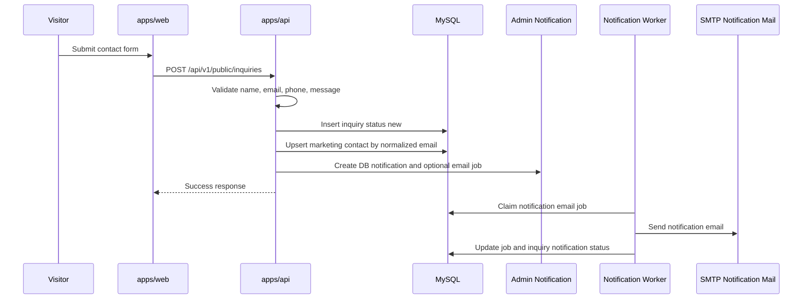
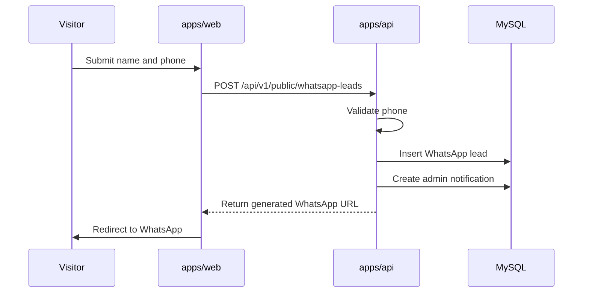
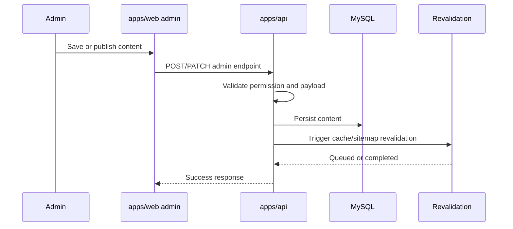
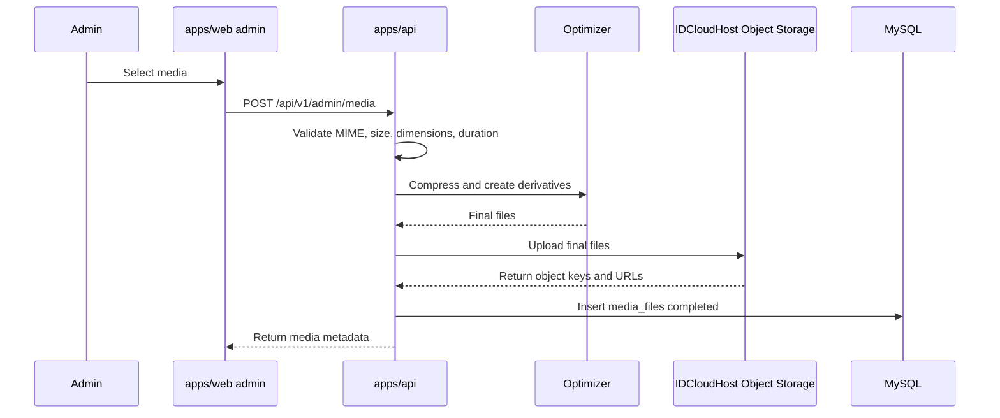
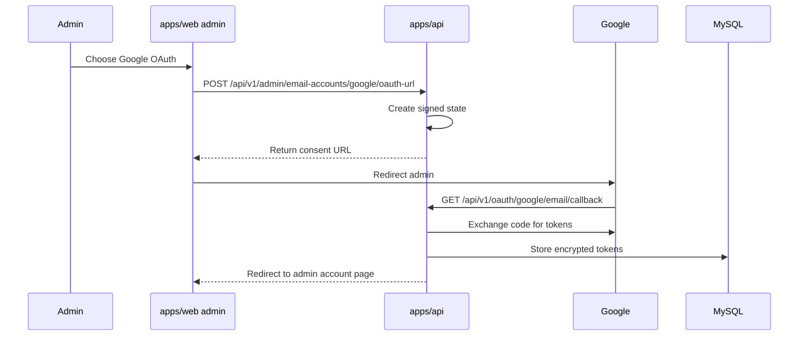
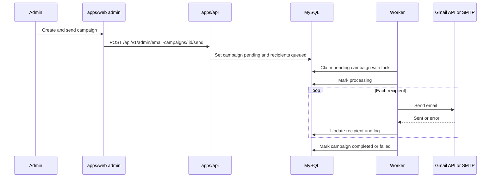
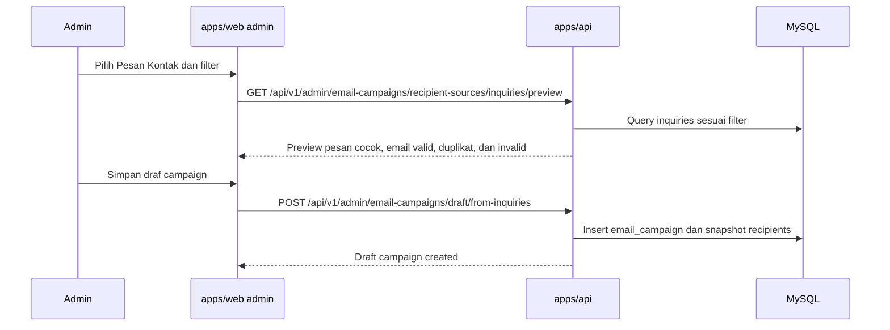

# Backend API Contract - Indobraga

Status: Kontrak backend MVP; implementasi `apps/api` selesai dan sudah dipakai oleh integrasi frontend `apps/web/`.  
Tanggal: 2026-05-09.  
Sumber utama: `PRD.md`, `PLAN.md`, dan frontend implementation `apps/web/src`.

Dokumen ini adalah kontrak endpoint dan workflow backend `apps/api`. Backend MVP sudah selesai sampai handoff package sesuai `PLAN.md`, dan frontend `apps/web/` sudah diintegrasikan ke API pada Fase 16 sampai 25. Dokumen ini tetap menjadi acuan untuk staging, deployment, dan perubahan kontrak berikutnya.

## 1. Scope

Backend MVP mendukung:

- Public website company profile.
- Dashboard admin.
- Content management untuk hero, logo klien, kekuatan produksi, portofolio, mesin/fasilitas, layanan, galeri, berita, dan pengaturan website.
- Lead dari contact form dan WhatsApp FAB.
- Media upload, validasi, optimasi, derivative, dan penyimpanan metadata.
- Akun pengirim email melalui Google OAuth/Gmail API dan SMTP Hosting.
- Email massal sederhana dengan worker berbasis database.
- SEO baseline: metadata, robots, sitemap, canonical support, noindex policy, dan revalidation.

Backend MVP tidak mencakup:

- E-commerce, pembayaran, tracking produksi, atau customer portal.
- Redis atau distributed cache sebagai dependency MVP.
- Microsoft OAuth, IMAP/POP3 sync, bounce processing lanjutan, provider email marketing eksternal.
- Template builder, open tracking, click tracking, segmentasi audience lanjutan di luar filter Pesan Kontak sederhana, scheduled campaign lanjutan, atau unsubscribe automation kompleks.
- HLS/adaptive streaming, AI tagging, face/object detection, atau advanced media library.

## 2. Base URL dan Versioning

Base path API:

```txt
/api/v1
```

Konvensi endpoint:

- Public data: `/api/v1/public/...`
- Admin data: `/api/v1/admin/...`
- Auth: `/api/v1/auth/...`
- OAuth callback: `/api/v1/oauth/...`
- Internal worker: `/api/v1/internal/...`

Versioning:

- Semua endpoint MVP memakai `/api/v1`.
- Breaking change memakai versi baru, misalnya `/api/v2`.
- Perubahan non-breaking boleh ditambahkan di versi yang sama.

## 3. Auth Strategy

Rekomendasi MVP:

- Admin memakai secure HTTP-only cookie session atau JWT berbasis cookie.
- Public endpoint tidak membutuhkan auth.
- Admin endpoint wajib authenticated.
- Endpoint internal worker wajib memakai internal secret atau mekanisme service identity.
- OAuth callback memakai signed `state` yang terikat ke session admin atau nonce sementara.

Cookie/session requirement jika memakai cookie:

- `HttpOnly`
- `Secure` di production
- `SameSite=Lax` atau `Strict` sesuai flow OAuth
- CSRF protection untuk request mutasi admin bila cookie digunakan

JWT requirement jika memakai token:

- Access token pendek.
- Refresh token disimpan aman.
- Token tidak boleh disimpan di localStorage untuk admin production.

Role minimal:

- `super_admin`
- `content_editor`

Session object untuk frontend:

```json
{
  "id": 1,
  "name": "Admin Indobraga",
  "email": "admin@indobraga.com",
  "role": "super_admin",
  "permissions": ["content.manage", "media.manage", "email.manage", "users.manage"]
}
```

## 4. Standard Response Envelope

Semua response sukses menggunakan envelope, kecuali raw streaming seperti Server-Sent Events:

```json
{
  "success": true,
  "data": {},
  "meta": {
    "request_id": "req_01HV...",
    "timestamp": "2026-05-08T00:00:00.000Z"
  }
}
```

Response list berbasis page:

```json
{
  "success": true,
  "data": {
    "items": [],
    "pagination": {
      "page": 1,
      "limit": 10,
      "total": 120,
      "total_pages": 12
    }
  },
  "meta": {
    "request_id": "req_01HV...",
    "timestamp": "2026-05-08T00:00:00.000Z"
  }
}
```

Response list berbasis cursor:

```json
{
  "success": true,
  "data": {
    "items": [],
    "next_cursor": "eyJpZCI6MTIzfQ",
    "has_more": true
  },
  "meta": {
    "request_id": "req_01HV...",
    "timestamp": "2026-05-08T00:00:00.000Z"
  }
}
```

Response create/update/delete:

```json
{
  "success": true,
  "data": {
    "id": 1,
    "status": "updated"
  },
  "meta": {
    "request_id": "req_01HV..."
  }
}
```

## 5. Standard Error Format

Semua error menggunakan format:

```json
{
  "success": false,
  "error": {
    "code": "VALIDATION_ERROR",
    "message": "Input tidak valid.",
    "details": [
      {
        "field": "email",
        "message": "Format email tidak valid."
      }
    ]
  },
  "meta": {
    "request_id": "req_01HV...",
    "timestamp": "2026-05-08T00:00:00.000Z"
  }
}
```

Kode error standar:

| HTTP | Code                     | Makna                                         |
| ---- | ------------------------ | --------------------------------------------- |
| 400  | `BAD_REQUEST`            | Request tidak valid secara umum               |
| 400  | `VALIDATION_ERROR`       | Field gagal validasi                          |
| 401  | `UNAUTHENTICATED`        | Belum login atau session invalid              |
| 403  | `FORBIDDEN`              | Role tidak memiliki izin                      |
| 404  | `NOT_FOUND`              | Resource tidak ditemukan                      |
| 409  | `CONFLICT`               | Duplikasi slug/email/status konflik           |
| 413  | `PAYLOAD_TOO_LARGE`      | Upload melebihi batas                         |
| 415  | `UNSUPPORTED_MEDIA_TYPE` | Tipe file tidak didukung                      |
| 422  | `UNPROCESSABLE_ENTITY`   | Data valid formatnya tapi gagal aturan bisnis |
| 429  | `RATE_LIMITED`           | Terlalu banyak request                        |
| 500  | `INTERNAL_ERROR`         | Error server                                  |
| 502  | `UPSTREAM_ERROR`         | Provider eksternal gagal                      |
| 503  | `SERVICE_UNAVAILABLE`    | Object storage/email provider tidak tersedia  |

Semua error internal harus dicatat di log backend dengan `request_id`.

## 6. Pagination dan Cursor Policy

Public API:

- Portofolio dan galeri memakai cursor pagination.
- Berita public memakai page pagination agar SEO-friendly.
- Limit default harus konservatif.

Admin API:

- Listing admin memakai page pagination agar cocok dengan tabel dan pagination dashboard.
- Filter/search/status/category harus eksplisit di query.

Default limit:

| Resource        | Public default | Public max | Admin default | Admin max |
| --------------- | -------------: | ---------: | ------------: | --------: |
| Portfolio       |              8 |         24 |            10 |       100 |
| Gallery         |              8 |         24 |            16 |       100 |
| News            |              6 |         24 |            10 |       100 |
| Inquiries       |              - |          - |            10 |       100 |
| WhatsApp leads  |              - |          - |            10 |       100 |
| Email campaigns |              - |          - |            10 |       100 |

Cursor harus opaque. Frontend tidak boleh bergantung pada struktur internal cursor.

## 7. Upload dan Media Policy

Media flow:

1. Admin memilih file di frontend.
2. Frontend boleh melakukan validasi dan kompresi awal.
3. Frontend mengirim multipart upload ke backend.
4. Backend melakukan validasi final, MIME sniffing, scan keamanan, dan batas ukuran.
5. Backend melakukan auto-rotate, strip metadata, resize, konversi format, dan kompresi final.
6. Backend membuat derivative.
7. Backend upload file final ke IDCloudHost Object Storage.
8. Backend menyimpan metadata ke `media_files`.
9. Backend mengembalikan metadata dan URL final ke admin.

Media image derivative minimal:

| Variant     | Kegunaan                          | Format utama |
| ----------- | --------------------------------- | ------------ |
| `thumbnail` | card, listing, grid, logo preview | WebP         |
| `medium`    | section homepage/detail ringan    | WebP         |
| `large`     | detail/lightbox/hero tertentu     | WebP         |

Video derivative minimal:

| Variant       | Kegunaan      | Format          |
| ------------- | ------------- | --------------- |
| `poster`      | preview video | WebP            |
| `video_final` | file final    | MP4 H.264 + AAC |

Object key:

```txt
upload/{dev|prod}/{kategori}/{yyyy-mm-dd}/{uuid}-{variant}.{ext}
```

Kategori object storage memakai slug bisnis Bahasa Indonesia, misalnya `berita`, `galeri`, `portofolio`, `mesin`, `partner`, `hero`, `seo`, atau `lainnya`. Nama file upload dari user tidak dipakai sebagai object key final untuk menghindari collision, karakter tidak aman, dan kebocoran informasi lokal.

Media cache:

- Media final memakai URL/object key unik.
- Media final boleh memakai `Cache-Control: public, max-age=31536000, immutable`.
- Jika admin mengganti media, backend membuat object key baru dan update referensi database.
- Backend tidak menyimpan binary media di database, Redis, atau memory aplikasi.

Media status:

- `processing`
- `completed`
- `failed`

Konten public hanya boleh memakai media dengan `compression_status = completed`.

## 8. Cache dan Revalidation Policy

MVP tidak memakai Redis. Strategi cache:

- Media: Object Storage -> CDN/custom media domain -> browser cache.
- Static frontend assets: hashed filename + long immutable cache.
- HTML/data public: cache pendek atau stale-while-revalidate.
- Admin/private data: `no-store` atau private cache.

Trigger revalidation:

- Create/update/delete/publish/unpublish konten public.
- Perubahan slug.
- Perubahan status featured.
- Perubahan sort order.
- Penggantian media.
- Perubahan site settings/SEO.

Cache key logis:

| Resource berubah   | Cache/revalidation target                                    |
| ------------------ | ------------------------------------------------------------ |
| Hero/site settings | `public:home`, `seo:site`, `sitemap`                         |
| Partner/logo       | `public:home`, `public:partners`                             |
| Strength           | `public:home`, `public:facilities`                           |
| Portfolio          | `public:home`, `public:portfolio:list`, `sitemap`            |
| Machine/facility   | `public:home`, `public:facilities`                           |
| Service            | `public:home`, `public:facilities`                           |
| Gallery            | `public:gallery:list`, `public:home` bila tampil di homepage |
| News               | `public:news:list`, `public:news:detail:{slug}`, `sitemap`   |
| SEO settings       | `seo:site`, `sitemap`                                        |

Revalidation adalah side effect backend/internal. Admin tidak mendapat tombol clear cache.

## 9. Data Model Contract

Data model mengikuti PRD. Field di bawah adalah kontrak minimal, bukan migration final.

### users

| Field                  | Tipe     | Catatan                          |
| ---------------------- | -------- | -------------------------------- |
| id                     | int      | PK                               |
| name                   | string   | Nama admin                       |
| email                  | string   | Unique                           |
| password_hash          | string   | Tidak pernah dikirim ke frontend |
| role                   | enum     | `super_admin`, `content_editor`  |
| is_active              | boolean  | Untuk cabut akses                |
| created_at, updated_at | datetime | Audit dasar                      |

### site_settings

| Field                  | Tipe      | Catatan                                      |
| ---------------------- | --------- | -------------------------------------------- |
| id                     | int       | PK                                           |
| key                    | string    | Unique                                       |
| value                  | text/json | Nilai konfigurasi                            |
| type                   | string    | `string`, `number`, `boolean`, `json`, `url` |
| created_at, updated_at | datetime  | Audit dasar                                  |

### hero_sections dan hero_slides

Hero content dapat dipisah:

- `hero_sections` untuk headline, subtitle, CTA.
- `hero_slides` untuk visual slider, metric, label, media.

Minimal field hero slide:

| Field         | Tipe   | Catatan                          |
| ------------- | ------ | -------------------------------- |
| id            | int    | PK                               |
| title/label   | string | Label slide                      |
| media_file_id | int    | FK optional                      |
| image_url     | string | URL final                        |
| alt_text      | string | Untuk aksesibilitas              |
| metric        | string | Contoh `90K pcs/bulan`           |
| sort_order    | int    | Urutan                           |
| status        | enum   | `draft`, `published`, `inactive` |

### portfolios

| Field                  | Tipe     | Catatan                          |
| ---------------------- | -------- | -------------------------------- |
| id                     | int      | PK                               |
| title                  | string   | Judul produk                     |
| category               | string   | Filter public                    |
| image_url              | string   | URL utama                        |
| thumbnail_url          | string   | Listing/card                     |
| medium_url             | string   | Homepage/detail ringan           |
| alt_text               | string   | Wajib untuk public image         |
| short_description      | text     | Ringkasan                        |
| sort_order             | int      | Urutan kuratif                   |
| is_featured            | boolean  | Tampil homepage                  |
| status                 | enum     | `draft`, `published`, `inactive` |
| created_at, updated_at | datetime | Audit dasar                      |

### gallery_items

| Field         | Tipe     | Catatan                          |
| ------------- | -------- | -------------------------------- |
| id            | int      | PK                               |
| media_file_id | int      | FK                               |
| media_type    | enum     | `image`, `video`                 |
| media_url     | string   | Media final                      |
| thumbnail_url | string   | Thumbnail/poster                 |
| caption       | text     | Singkat, bukan artikel           |
| alt_text      | string   | Wajib untuk image                |
| sort_order    | int      | Urutan kuratif                   |
| status        | enum     | `draft`, `published`, `inactive` |
| published_at  | datetime | Urutan public                    |

### news

| Field           | Tipe     | Catatan                          |
| --------------- | -------- | -------------------------------- |
| id              | int      | PK                               |
| title           | string   | Judul berita                     |
| slug            | string   | Unique                           |
| category        | string   | Filter/kategori                  |
| thumbnail_url   | string   | Listing/OG fallback              |
| excerpt         | text     | Listing                          |
| content         | longtext | Detail                           |
| status          | enum     | `draft`, `published`, `inactive` |
| seo_title       | string   | Optional                         |
| seo_description | string   | Optional                         |
| og_image_url    | string   | Optional                         |
| published_at    | datetime | SEO/public                       |

### inquiries dan whatsapp_leads

Status:

- `new`
- `contacted`
- `in_progress`
- `closed`
- `spam`

Inquiry field minimal:

| Field                     | Tipe   | Catatan                     |
| ------------------------- | ------ | --------------------------- |
| id                        | int    | PK                          |
| name                      | string | Wajib                       |
| email                     | string | Wajib valid email           |
| phone                     | string | Wajib valid phone           |
| company                   | string | Optional                    |
| message                   | text   | Wajib                       |
| status                    | enum   | Follow-up                   |
| internal_note             | text   | Admin only                  |
| email_notification_status | enum   | `pending`, `sent`, `failed` |

WhatsApp lead field minimal:

| Field             | Tipe   | Catatan        |
| ----------------- | ------ | -------------- |
| id                | int    | PK             |
| name              | string | Wajib          |
| phone             | string | Wajib          |
| generated_message | text   | Pesan redirect |
| status            | enum   | Follow-up      |
| internal_note     | text   | Admin only     |

### media_files

Field minimal mengikuti PRD:

- id
- file_name
- original_file_name
- storage_provider
- bucket
- object_key
- file_url
- thumbnail_url
- medium_url
- large_url
- mime_type
- media_type
- original_size
- optimized_size
- width
- height
- duration_seconds
- checksum_hash
- compression_status
- compression_error
- uploaded_by
- created_at
- updated_at

### email_accounts

Provider:

- `google`
- `smtp`

Auth type:

- `oauth`
- `smtp_password`

Status:

- `connected`
- `expired`
- `revoked`
- `invalid`
- `disabled`

Secret fields tidak pernah dikirim ke frontend:

- `encrypted_smtp_secret`
- `encrypted_access_token`
- `encrypted_refresh_token`

### email_campaigns

Status:

- `draft`
- `pending`
- `processing`
- `completed`
- `failed`
- `cancelled`

Recipient status:

- `queued`
- `sending`
- `sent`
- `failed`
- `skipped`

### marketing_contacts

`marketing_contacts` adalah tabel internal untuk normalisasi email dari Pesan Kontak. UI Email Massal tidak perlu menampilkan istilah ini ke admin; flow bisnis menggunakan pilihan Pesan Kontak atau Upload CSV.

Source:

- `inquiry`
- `whatsapp_lead`
- `manual_import`
- `manual`

Status:

- `active`
- `unsubscribed`
- `blocked`

Consent status:

- `implied`
- `explicit`
- `unknown`

Catatan implementasi:

- `email` dinormalisasi lowercase dan unik.
- Pesan Kontak public dengan email valid otomatis di-upsert ke `marketing_contacts` untuk kebutuhan deduplikasi internal.
- Campaign dari Pesan Kontak atau CSV hanya boleh mengambil email valid setelah deduplikasi.
- `email_campaign_recipients` adalah snapshot campaign dan boleh menyimpan `marketing_contact_id` opsional agar histori tidak berubah ketika kontak diperbarui.

### notifications

Notifikasi admin menggunakan database sebagai sumber kebenaran dan SSE sebagai transport realtime ringan.

Notification type minimal:

- `inquiry_created`
- `whatsapp_lead_created`
- `email_campaign_completed`
- `email_campaign_failed`
- `media_failed`
- `smtp_invalid`
- `system_warning`

Severity:

- `info`
- `success`
- `warning`
- `error`

Tabel terkait:

- `notifications`: event admin, title/message bisnis, resource target, expiry optional.
- `notification_reads`: status baca per user admin.
- `notification_email_jobs`: queue email notifikasi operasional yang diproses worker internal.

Catatan implementasi:

- Notifikasi bell admin tidak boleh bergantung pada email berhasil terkirim.
- Request public tetap sukses jika pembuatan email job gagal; kegagalan dicatat di log backend.
- Email notifikasi diproses worker agar submit form tidak menunggu SMTP.

## 10. Workflow Contract

### Public Contact Form



Jika email notification gagal, inquiry tetap tersimpan.

### WhatsApp FAB



### Admin Publish Content



Revalidation failure tidak membatalkan data utama, tetapi wajib dicatat dan retry.

### Media Upload



### Email Account Google OAuth



### Email Campaign Worker



### Email Campaign dari Pesan Kontak atau CSV



Untuk sumber CSV, frontend menyediakan download template, membaca file CSV di browser, memvalidasi email, melakukan deduplikasi, lalu memakai endpoint `POST /api/v1/admin/email-campaigns/draft` dengan payload recipients. Endpoint pembuatan draf tidak mengirim email langsung. Admin tetap memanggil endpoint send agar campaign mulai dikirim.

## 11. Public API

Public response tidak boleh mengirim field internal seperti draft, internal note, secret, uploaded_by, atau audit internal yang tidak relevan.

### GET /api/v1/public/site-settings

Tujuan: mengambil konfigurasi public ringan seperti brand, legal name, kontak, WhatsApp, social media, dan SEO default.

Auth: public.

Query: tidak ada.

Response data:

```json
{
  "brand": "Indobraga",
  "legal_name": "PT. Braga Indonesia Perkasa",
  "email": "indobraga@gmail.com",
  "phone": "0851-5870-0895",
  "whatsapp": "6285158700895",
  "instagram": "indobraga",
  "address": "Jalan Babakan Tarogong No. 292, Kota Bandung",
  "seo": {
    "title": "Indobraga - Solusi Produksi Garment Profesional",
    "description": "Apparel manufacturing, garment production, dan cetak kain custom.",
    "og_image_url": "https://media.example/og.webp"
  }
}
```

Cache: public cache pendek atau stale-while-revalidate.  
Revalidation: site settings update.  
Frontend: public layout, kontak, WhatsApp FAB, metadata default.

### GET /api/v1/public/home

Tujuan: mengambil data homepage dalam payload ringan.

Auth: public.

Response data:

```json
{
  "hero": {
    "kicker": "Garment & sublim specialist sejak 2010",
    "title": "Produksi Garment dan Sublim Skala Bisnis",
    "subtitle": "Indobraga membantu brand, komunitas, dan perusahaan...",
    "primary_cta": { "label": "Konsultasi Produksi", "url": "/kontak" },
    "secondary_cta": { "label": "Lihat Portofolio", "url": "/portfolio" },
    "slides": []
  },
  "partners": [],
  "strengths": [],
  "featured_portfolios": [],
  "facilities_summary": {},
  "latest_news": []
}
```

Validasi: hanya konten active/published.  
Cache: public cache pendek atau stale-while-revalidate.  
Revalidation: perubahan hero, partners, strengths, featured portfolio, facilities, services, news, site settings.  
Frontend: `/`.

### GET /api/v1/public/portfolio

Tujuan: daftar portofolio published untuk halaman public.

Auth: public.

Query:

- `category?: string`
- `limit?: number` default 8, max 24
- `cursor?: string`

Response data:

```json
{
  "items": [
    {
      "id": 1,
      "title": "Training Jersey Klub Profesional",
      "category": "Jersey",
      "thumbnail_url": "https://media.example/thumb.webp",
      "medium_url": "https://media.example/medium.webp",
      "alt_text": "Jersey training klub profesional",
      "short_description": "Jersey training, home, away, dan third kit..."
    }
  ],
  "next_cursor": null,
  "has_more": false
}
```

Validasi: category harus string aman. Limit dibatasi.  
Cache: public cache pendek atau stale-while-revalidate.  
Revalidation: portfolio create/update/publish/unpublish/delete/reorder/media change.  
Frontend: `/portfolio`, homepage featured section.

### GET /api/v1/public/facilities

Tujuan: mengambil data fasilitas, mesin, layanan, printing capacity, dan production capacity.

Auth: public.

Response data:

```json
{
  "strengths": [],
  "machines": [],
  "printing_capacities": [],
  "production_capacities": [],
  "services": []
}
```

Validasi: hanya active/published.  
Cache: public cache pendek atau stale-while-revalidate.  
Revalidation: machines, printing capacity, production capacity, services, strengths.  
Frontend: `/fasilitas`.

### GET /api/v1/public/gallery

Tujuan: daftar galeri published berbasis cursor.

Auth: public.

Query:

- `type?: image|video`
- `limit?: number` default 8, max 24
- `cursor?: string`

Response data:

```json
{
  "items": [
    {
      "id": 1,
      "type": "image",
      "thumbnail_url": "https://media.example/gallery-thumb.webp",
      "media_url": "https://media.example/gallery-large.webp",
      "caption": "Lini sublimasi Atexco Model X Plus.",
      "alt_text": "Lini sublimasi Indobraga",
      "published_at": "2026-04-20T00:00:00.000Z"
    }
  ],
  "next_cursor": null,
  "has_more": false
}
```

Validasi: type enum. Limit dibatasi.  
Cache: public cache pendek atau stale-while-revalidate.  
Revalidation: gallery create/update/publish/unpublish/delete/reorder/media change.  
Frontend: `/galeri`.

### GET /api/v1/public/news

Tujuan: listing berita published dengan page pagination SEO-friendly.

Auth: public.

Query:

- `page?: number` default 1
- `limit?: number` default 6, max 24
- `category?: string`

Response data:

```json
{
  "items": [
    {
      "id": 1,
      "title": "Indobraga Perkuat Produksi dengan Atexco Model X Plus",
      "slug": "atexco-model-x-plus",
      "category": "Fasilitas",
      "thumbnail_url": "https://media.example/news.webp",
      "excerpt": "Mesin fabric sublimation berkapasitas besar...",
      "published_at": "2026-04-22T00:00:00.000Z"
    }
  ],
  "pagination": {
    "page": 1,
    "limit": 6,
    "total": 30,
    "total_pages": 5
  }
}
```

Cache: public cache pendek atau stale-while-revalidate.  
Revalidation: news create/update/publish/unpublish/delete/slug change.  
Frontend: `/berita?page=1`.

### GET /api/v1/public/news/:slug

Tujuan: detail berita published.

Auth: public.

Path params:

- `slug: string`

Response data:

```json
{
  "id": 1,
  "title": "Indobraga Perkuat Produksi dengan Atexco Model X Plus",
  "slug": "atexco-model-x-plus",
  "category": "Fasilitas",
  "thumbnail_url": "https://media.example/news.webp",
  "content": ["Paragraf 1", "Paragraf 2"],
  "seo": {
    "title": "Indobraga Perkuat Produksi dengan Atexco Model X Plus",
    "description": "Mesin fabric sublimation berkapasitas besar...",
    "canonical_url": "https://indobraga.com/berita/atexco-model-x-plus",
    "og_image_url": "https://media.example/news.webp"
  },
  "published_at": "2026-04-22T00:00:00.000Z"
}
```

Errors: 404 jika slug tidak ditemukan atau belum published.  
Cache: public cache pendek atau stale-while-revalidate.  
Revalidation: news detail update/slug/status/media change.  
Frontend: `/berita/$slug`.

### POST /api/v1/public/inquiries

Tujuan: menerima contact form public.

Auth: public.

Request body:

```json
{
  "name": "Budi Santoso",
  "email": "budi@example.co.id",
  "phone": "08123456789",
  "company": "PT Sumber Makmur",
  "message": "Butuh produksi 2.000 polo shirt."
}
```

Response data:

```json
{
  "id": 123,
  "status": "received",
  "message": "Pesan berhasil dikirim."
}
```

Validasi:

- name wajib.
- email wajib valid.
- phone wajib valid.
- message wajib dan dibatasi panjang.

Side effect:

- Insert inquiry status `new`.
- Kirim email notification ke Indobraga.
- Simpan `email_notification_status`.

Cache: no-store.  
Frontend: `/kontak`.

### POST /api/v1/public/whatsapp-leads

Tujuan: menyimpan lead WhatsApp dan mengembalikan URL redirect WhatsApp.

Auth: public.

Request body:

```json
{
  "name": "Andi Pratama",
  "phone": "08123456789"
}
```

Response data:

```json
{
  "id": 123,
  "whatsapp_url": "https://wa.me/6285158700895?text=Halo%20Indobraga...",
  "generated_message": "Halo Indobraga, saya Andi Pratama..."
}
```

Validasi:

- name wajib.
- phone wajib valid.

Side effect:

- Insert WhatsApp lead status `new`.

Cache: no-store.  
Frontend: WhatsApp FAB.

## 12. Auth API

### POST /api/v1/auth/login

Auth: public.

Request:

```json
{
  "email": "admin@indobraga.com",
  "password": "secret"
}
```

Success:

```json
{
  "user": {
    "id": 1,
    "name": "Admin Indobraga",
    "email": "admin@indobraga.com",
    "role": "super_admin",
    "permissions": []
  }
}
```

Validation:

- email valid.
- password wajib.
- user harus active.

Side effect:

- Buat session.
- Set secure cookie bila memakai cookie.

Cache: no-store.  
Frontend: `/login`.

### POST /api/v1/auth/logout

Auth: admin.

Side effect:

- Invalidate session.
- Clear cookie.

Cache: no-store.  
Frontend: admin layout logout.

### GET /api/v1/auth/me

Auth: admin.

Tujuan: membaca session admin aktif.

Cache: no-store.  
Frontend: admin route guard dan topbar.

### POST /api/v1/auth/refresh

Auth: refresh token/session.

Status: optional, hanya jika strategi auth membutuhkan refresh token eksplisit.

## 13. Admin Content API

Semua endpoint pada bagian ini:

- Auth: admin.
- Cache: no-store.
- Response tidak boleh memuat secret.
- Mutasi harus mencatat `updated_by` bila audit log diaktifkan.
- Mutasi konten public harus memicu revalidation sesuai resource.

### Admin Resource Pattern

Pola umum untuk resource content:

| Method | Path                                  | Tujuan                 | Request                      | Response        | Side effect                      |
| ------ | ------------------------------------- | ---------------------- | ---------------------------- | --------------- | -------------------------------- |
| GET    | `/api/v1/admin/{resource}`            | Listing admin          | query page, limit, q, status | paginated items | none                             |
| GET    | `/api/v1/admin/{resource}/:id`        | Detail admin           | path id                      | item detail     | none                             |
| POST   | `/api/v1/admin/{resource}`            | Create                 | JSON body                    | created id/item | revalidate bila published        |
| PATCH  | `/api/v1/admin/{resource}/:id`        | Update                 | JSON partial                 | updated id/item | revalidate bila public-impacting |
| PATCH  | `/api/v1/admin/{resource}/:id/status` | Draft/publish/inactive | status body                  | updated status  | revalidate                       |
| PATCH  | `/api/v1/admin/{resource}/reorder`    | Update sort order      | ids/order                    | updated count   | revalidate                       |
| DELETE | `/api/v1/admin/{resource}/:id`        | Soft delete/inactive   | path id                      | deleted status  | revalidate                       |

Soft delete lebih direkomendasikan daripada hard delete untuk konten public.

### Resource Matrix

| Resource              | Base path                             | Frontend screen    | Search/filter       | Revalidation             |
| --------------------- | ------------------------------------- | ------------------ | ------------------- | ------------------------ |
| Site settings         | `/api/v1/admin/site-settings`         | Pengaturan Website | key/group           | home, seo, sitemap       |
| Hero                  | `/api/v1/admin/hero`                  | Konten Beranda     | status              | home                     |
| Hero slides           | `/api/v1/admin/hero-slides`           | Konten Beranda     | status              | home                     |
| Partners              | `/api/v1/admin/partners`              | Logo Klien         | q, segment, status  | home                     |
| Strengths             | `/api/v1/admin/production-strengths`  | Kekuatan Produksi  | q, status           | home, facilities         |
| Portfolios            | `/api/v1/admin/portfolios`            | Portofolio Produk  | q, category, status | home, portfolio, sitemap |
| Machines              | `/api/v1/admin/machines`              | Mesin & Fasilitas  | q, status           | home, facilities         |
| Printing capacities   | `/api/v1/admin/printing-capacities`   | Mesin & Fasilitas  | q, status           | home, facilities         |
| Production capacities | `/api/v1/admin/production-capacities` | Mesin & Fasilitas  | q, status           | facilities               |
| Services              | `/api/v1/admin/services`              | Daftar Layanan     | q, status           | home, facilities         |
| Gallery               | `/api/v1/admin/gallery-items`         | Galeri Perusahaan  | q, type, status     | gallery, home            |
| News                  | `/api/v1/admin/news`                  | Berita             | q, category, status | news, sitemap            |

### Portfolio Payload

Create/update request:

```json
{
  "title": "Training Jersey Klub Profesional",
  "category": "Jersey",
  "short_description": "Jersey training untuk kebutuhan tim olahraga profesional.",
  "media_file_id": 10,
  "alt_text": "Jersey training klub profesional",
  "sort_order": 1,
  "is_featured": true,
  "status": "published"
}
```

Validation:

- title wajib.
- category wajib.
- media_file_id optional untuk draft, wajib untuk published jika belum ada image.
- media harus `completed`.
- status enum.

### Gallery Payload

```json
{
  "media_file_id": 22,
  "media_type": "image",
  "caption": "Lini sublimasi Atexco Model X Plus.",
  "alt_text": "Lini sublimasi Indobraga",
  "sort_order": 1,
  "status": "published",
  "published_at": "2026-05-08T00:00:00.000Z"
}
```

Validation:

- caption wajib dan singkat.
- media_type enum.
- media_file_id harus completed.

### News Payload

```json
{
  "title": "Indobraga Perkuat Produksi dengan Atexco Model X Plus",
  "slug": "atexco-model-x-plus",
  "category": "Fasilitas",
  "thumbnail_media_file_id": 10,
  "excerpt": "Mesin fabric sublimation berkapasitas besar...",
  "content": ["Paragraf 1", "Paragraf 2"],
  "status": "published",
  "published_at": "2026-04-22T00:00:00.000Z",
  "seo_title": "Indobraga Perkuat Produksi dengan Atexco Model X Plus",
  "seo_description": "Mesin fabric sublimation berkapasitas besar...",
  "og_image_media_file_id": 10
}
```

Validation:

- title wajib.
- slug unique dan SEO-friendly.
- content wajib saat published.
- published_at wajib saat published.

## 14. Lead API

Semua endpoint admin lead:

- Auth: admin.
- Cache: no-store.
- Permission: `leads.read` untuk baca, `leads.manage` untuk update/delete.

### Endpoint Matrix

| Method | Path                               | Tujuan                   | Query/body                      | Response            | Frontend         |
| ------ | ---------------------------------- | ------------------------ | ------------------------------- | ------------------- | ---------------- |
| GET    | `/api/v1/admin/inquiries`          | Listing pesan kontak     | page, limit, q, status          | paginated inquiries | Pesan Kontak     |
| GET    | `/api/v1/admin/inquiries/:id`      | Detail pesan             | id                              | inquiry detail      | Modal detail     |
| PATCH  | `/api/v1/admin/inquiries/:id`      | Update status/catatan    | status, internal_note, assignee | updated inquiry     | Modal detail     |
| DELETE | `/api/v1/admin/inquiries/:id`      | Arsip/soft delete        | id                              | deleted status      | Pesan Kontak     |
| GET    | `/api/v1/admin/whatsapp-leads`     | Listing prospek WhatsApp | page, limit, q, status          | paginated leads     | Prospek WhatsApp |
| GET    | `/api/v1/admin/whatsapp-leads/:id` | Detail lead              | id                              | lead detail         | Modal detail     |
| PATCH  | `/api/v1/admin/whatsapp-leads/:id` | Update status/catatan    | status, internal_note           | updated lead        | Modal detail     |
| DELETE | `/api/v1/admin/whatsapp-leads/:id` | Arsip/soft delete        | id                              | deleted status      | Prospek WhatsApp |

Validation:

- status harus enum.
- internal_note max length.
- delete harus soft delete atau archived flag.

### Admin Audience Internal

Semua endpoint audience:

- Auth: admin.
- Cache: no-store.
- Permission: `audience.read` untuk list/preview, `audience.export` untuk CSV export.

| Method | Path                                | Tujuan                                         | Query/body                     | Response           | Frontend             |
| ------ | ----------------------------------- | ---------------------------------------------- | ------------------------------ | ------------------ | -------------------- |
| GET    | `/api/v1/admin/audience/contacts`   | Listing kontak internal                        | page, limit, q, source, status | paginated contacts | Operasional internal |
| GET    | `/api/v1/admin/audience/preview`    | Preview kontak internal                        | q, source                      | counts + sample    | Operasional internal |
| GET    | `/api/v1/admin/audience/export.csv` | Export kontak internal aktif atau hasil filter | q, source, status              | raw CSV attachment | Operasional internal |

Response preview:

```json
{
  "total_contacts": 12,
  "eligible_recipients": 10,
  "excluded_unsubscribed": 1,
  "excluded_blocked": 1,
  "sample_recipients": [
    { "id": 1, "name": "Budi", "email": "budi@example.com", "company": "PT Contoh" }
  ]
}
```

Catatan:

- CSV export adalah raw response dan tidak memakai JSON envelope.
- Endpoint audience dipertahankan sebagai fasilitas internal/operasional, bukan flow utama UI Email Massal.
- Pesan Kontak public otomatis upsert ke kontak internal memakai email yang dinormalisasi.

## 15. Media API

Semua endpoint media:

- Auth: admin.
- Permission: `media.manage`.
- Cache admin response: no-store.

### POST /api/v1/admin/media

Tujuan: upload media dinamis.

Content-Type: `multipart/form-data`.

Fields:

- `file`: binary wajib.
- `usage`: `hero|partner|portfolio|machine|gallery|news|og|other`.
- `alt_text?: string`.
- `caption?: string`.

Response data:

```json
{
  "id": 10,
  "media_type": "image",
  "mime_type": "image/webp",
  "compression_status": "completed",
  "file_url": "https://media.indobraga.com/upload/prod/galeri/2026-05-09/uuid-large.webp",
  "thumbnail_url": "https://media.indobraga.com/upload/prod/galeri/2026-05-09/uuid-thumbnail.webp",
  "medium_url": "https://media.indobraga.com/upload/prod/galeri/2026-05-09/uuid-medium.webp",
  "large_url": "https://media.indobraga.com/upload/prod/galeri/2026-05-09/uuid-large.webp",
  "width": 1600,
  "height": 1200,
  "optimized_size": 180000
}
```

Validation:

- MIME sniffing wajib.
- Reject file berbahaya.
- Batas ukuran image dan video mengikuti konfigurasi.
- SVG hanya boleh jika sanitasi tersedia; jika tidak, reject.

Side effect:

- Upload derivative ke object storage.
- Insert metadata.
- Cleanup file temporary.

### GET /api/v1/admin/media

Query:

- page, limit
- q
- media_type
- compression_status
- usage

Response: paginated media metadata.

### GET /api/v1/admin/media/:id

Response: media metadata detail, tanpa binary.

### DELETE /api/v1/admin/media/:id

Tujuan: mark media tidak aktif atau hapus jika aman.

Rule:

- Jika media masih direferensikan konten aktif, return 409 atau hanya mark pending cleanup.
- Object storage cleanup boleh asynchronous.

### POST /api/v1/admin/media/:id/retry

Tujuan: retry media failed.

Rule:

- Hanya untuk `compression_status = failed`.
- Jika original temporary sudah tidak tersedia, admin harus upload ulang.

## 16. Email Account API

Semua endpoint admin email account:

- Auth: admin.
- Permission: `email.manage`.
- Cache: no-store.
- Secret/token tidak pernah dikirim ke frontend.

### GET /api/v1/admin/email-accounts

Query:

- page, limit
- q
- provider: `google|smtp`
- status

Response item:

```json
{
  "id": 1,
  "provider": "google",
  "auth_type": "oauth",
  "email_address": "marketing@indobraga.com",
  "display_name": "Marketing",
  "status": "connected",
  "smtp_host": null,
  "last_validated_at": "2026-05-08T00:00:00.000Z",
  "connected_at": "2026-05-01T00:00:00.000Z",
  "last_error": null
}
```

### POST /api/v1/admin/email-accounts/google/oauth-url

Request:

```json
{
  "email_hint": "marketing@indobraga.com",
  "display_name": "Marketing"
}
```

Response:

```json
{
  "authorization_url": "https://accounts.google.com/o/oauth2/v2/auth?...",
  "state_expires_at": "2026-05-08T00:10:00.000Z"
}
```

Validation:

- email_hint optional tapi jika ada harus valid.
- state wajib signed dan expiring.

Side effect:

- Simpan OAuth state sementara.

### GET /api/v1/oauth/google/email/callback

Query dari Google:

- `code`
- `state`
- `error?`

Behavior:

- Validasi state.
- Exchange code ke token.
- Ambil email profile bila diperlukan.
- Simpan token terenkripsi.
- Set status `connected`.
- Redirect admin ke `/admin/email-accounts?connected=google`.

Error behavior:

- Jika consent gagal, redirect dengan status error aman.
- Jangan tampilkan token/error teknis mentah ke frontend.

### POST /api/v1/admin/email-accounts/smtp/test

Tujuan: test konfigurasi SMTP tanpa menyimpan permanen.

Request:

```json
{
  "email_address": "newsletter@indobraga.com",
  "display_name": "Newsletter",
  "smtp_host": "smtp.hostinger.com",
  "smtp_port": 465,
  "smtp_security": "ssl_tls",
  "smtp_username": "newsletter@indobraga.com",
  "smtp_password": "secret"
}
```

Response:

```json
{
  "valid": true,
  "message": "Koneksi SMTP berhasil."
}
```

Validation:

- smtp_security: `ssl_tls`, `starttls`, `none`.
- `none` tidak boleh production.
- timeout wajib dibatasi.

### POST /api/v1/admin/email-accounts/smtp

Tujuan: simpan akun SMTP setelah test valid.

Request: sama seperti test.

Side effect:

- Test connection/test send.
- Enkripsi secret.
- Insert email account status `connected`.

### PATCH /api/v1/admin/email-accounts/:id

Tujuan: update display_name, status, atau konfigurasi SMTP.

Rule:

- Jika secret SMTP diubah, wajib test ulang.
- Google OAuth token tidak diupdate lewat endpoint ini.

### POST /api/v1/admin/email-accounts/:id/reconnect

Behavior:

- Google: return authorization URL baru.
- SMTP: return instruksi bahwa admin perlu update credential/test ulang.

### POST /api/v1/admin/email-accounts/:id/disable

Tujuan: nonaktifkan akun tanpa menghapus history.

### DELETE /api/v1/admin/email-accounts/:id

Tujuan: soft delete/disable akun.

Rule:

- Campaign history tetap menyimpan referensi akun.

## 17. Email Campaign API

Semua endpoint:

- Auth: admin.
- Permission: `email_campaigns.read`, `email_campaigns.manage`, atau `email_campaigns.send` sesuai aksi.
- Cache: no-store.

### GET /api/v1/admin/email-campaigns

Query:

- page, limit
- q
- status
- email_account_id

Response: paginated campaign summary.

### GET /api/v1/admin/email-campaigns/:id

Response: campaign detail, agregat, dan konfigurasi pengirim tanpa secret.

### POST /api/v1/admin/email-campaigns/draft

Request:

```json
{
  "title": "Promo Kuartal 2 2026",
  "email_account_id": 1,
  "subject": "Penawaran Produksi Garment",
  "body_text": "Halo {{nama}}",
  "body_html": "<p>Halo {{nama}}</p>",
  "recipients": [{ "name": "Budi", "email": "budi@example.co.id" }]
}
```

Validation:

- title wajib.
- email_account_id wajib connected.
- subject wajib.
- body_text atau body_html wajib dan tidak boleh kosong setelah trim/HTML cleanup; jika body_html kosong backend dapat membuat HTML sederhana dari body_text.
- recipients max limit mengikuti konfigurasi MVP.
- email recipient harus valid dan deduplicate per campaign.

Response:

```json
{
  "id": 10,
  "status": "draft",
  "total_recipients": 1
}
```

### GET /api/v1/admin/email-campaigns/recipient-sources/inquiries/preview

Tujuan: preview penerima Email Massal dari Pesan Kontak sebelum admin menyimpan draf.

Query:

```text
q=seragam
status=new
date_from=2026-05-01
date_to=2026-05-31
```

Catatan:

- `status` opsional. Jika kosong, backend memakai semua Pesan Kontak kecuali spam.
- `date_from` dan `date_to` memakai tanggal lokal Indonesia.
- Backend menghitung email valid, duplikat, dan email tidak valid.

Response:

```json
{
  "total_inquiries": 24,
  "eligible_recipients": 18,
  "duplicate_emails": 3,
  "invalid_emails": 0,
  "recipient_limit": 1000,
  "over_limit": false,
  "sample_recipients": [
    {
      "id": 12,
      "name": "Budi",
      "email": "budi@example.co.id",
      "company": "PT Contoh",
      "status": "new",
      "created_at": "2026-05-09T10:00:00.000Z"
    }
  ]
}
```

### POST /api/v1/admin/email-campaigns/draft/from-inquiries

Tujuan: membuat draf campaign dari filter Pesan Kontak.

Request:

```json
{
  "title": "Follow up Pesan Kontak Mei 2026",
  "email_account_id": 1,
  "subject": "Terima kasih sudah menghubungi Indobraga",
  "body_text": "Halo {{nama}}, kami siap membantu kebutuhan produksi Anda.",
  "inquiry_filter": {
    "q": "seragam",
    "status": "new",
    "date_from": "2026-05-01",
    "date_to": "2026-05-31"
  }
}
```

Behavior:

- Backend resolve Pesan Kontak berdasarkan filter, menolak spam secara default jika status tidak dipilih.
- Backend hanya memasukkan email valid dan melakukan deduplikasi.
- Jika hasil nol, response `422`.
- Jika hasil melebihi `EMAIL_CAMPAIGN_RECIPIENT_MAX`, response `422` dan admin harus mempersempit filter.
- Backend membuat snapshot ke `email_campaign_recipients`.
- Endpoint ini hanya membuat draf; pengiriman tetap lewat `POST /api/v1/admin/email-campaigns/:id/send`.

Response sama seperti create draft manual.

### Upload CSV Penerima

Upload CSV untuk Email Massal diproses di frontend agar admin dapat melihat preview cepat sebelum draf dibuat.

Template CSV:

```csv
nama,email,perusahaan,telepon,catatan
Budi Santoso,budi@example.com,PT Contoh,08123456789,Prospek seragam kantor
```

Rule:

- Kolom `email` wajib ada.
- Kolom `nama`, `perusahaan`, `telepon`, dan `catatan` opsional.
- Frontend menampilkan jumlah baris dibaca, email valid, duplikat, dan email tidak valid.
- Setelah admin menyimpan draf, frontend mengirim email valid ke `POST /api/v1/admin/email-campaigns/draft` sebagai `recipients`.

### PATCH /api/v1/admin/email-campaigns/:id

Rule:

- Hanya campaign `draft` yang boleh diedit penuh.
- Campaign `pending/processing/completed` tidak boleh diubah body/recipient.

### POST /api/v1/admin/email-campaigns/:id/send

Tujuan: mengubah draft menjadi pending untuk diproses worker.

Validation:

- campaign harus draft.
- akun pengirim harus connected.
- recipients tidak kosong.

Side effect:

- Set status `pending`.
- Set recipients `queued`.
- Worker akan mengambil.

### GET /api/v1/admin/email-campaigns/:id/recipients

Query:

- page, limit
- status
- q

Response: paginated recipients.

### GET /api/v1/admin/email-campaigns/:id/logs

Query:

- page, limit
- status

Response: paginated send logs.

## 18. Admin Notification API

Semua endpoint admin notification:

- Auth: admin.
- Permission: `notifications.read`.
- Cache: no-store.
- Source of truth: database.

### GET /api/v1/admin/notifications

Query:

- `page`, `limit`
- `read`: `all|unread`
- `q`

Response data:

```json
{
  "items": [
    {
      "id": 1,
      "type": "inquiry_created",
      "severity": "info",
      "title": "Pesan kontak baru",
      "message": "Budi mengirim pesan kontak dari website.",
      "resource_type": "inquiry",
      "resource_id": 12,
      "read": false,
      "created_at": "2026-05-09T13:20:00.000Z"
    }
  ],
  "pagination": {
    "page": 1,
    "limit": 10,
    "total": 1,
    "total_pages": 1
  }
}
```

### GET /api/v1/admin/notifications/unread-count

Response data:

```json
{
  "unread_count": 3
}
```

### GET /api/v1/admin/notifications/stream

Transport: Server-Sent Events.

Catatan:

- Endpoint ini adalah raw SSE stream, bukan JSON envelope.
- Cookie session admin tetap dipakai.
- Event `connected` dikirim saat koneksi terbuka.
- Event `heartbeat` dikirim berkala agar proxy tidak menutup koneksi diam.
- Event `notification.created` dikirim saat ada notifikasi baru.
- Event `notification.read` dikirim saat user menandai notifikasi dibaca.

Payload event:

```json
{
  "type": "notification.created",
  "notification_id": 1,
  "resource_type": "inquiry",
  "resource_id": 12,
  "timestamp": "2026-05-09T13:20:00.000Z"
}
```

### POST /api/v1/admin/notifications/:id/read

Side effect: upsert row `notification_reads` untuk user admin aktif.

Response data:

```json
{
  "unread_count": 2
}
```

### POST /api/v1/admin/notifications/read-all

Side effect: membuat `notification_reads` untuk notifikasi aktif yang belum dibaca user.

Response data:

```json
{
  "marked_read": 3,
  "unread_count": 0
}
```

Frontend behavior:

- Bell admin memakai SSE ketika tab admin aktif.
- Jika SSE gagal, frontend boleh fallback polling lambat sekitar 120 detik.
- Klik notifikasi mengarah ke layar bisnis terkait: Pesan Kontak, Prospek WhatsApp, Akun Pengirim Email, Riwayat Email Massal, atau Galeri.

## 19. Worker/Internal Contract

Internal endpoint atau service method tidak dipanggil frontend.

### POST /api/v1/internal/workers/email-campaigns/tick

Auth: internal service identity.

Tujuan: menjalankan satu batch pemrosesan campaign.

Behavior:

1. Claim campaign status `pending` dengan lock database.
2. Set campaign `processing`.
3. Ambil recipients status `queued`.
4. Kirim bertahap sesuai rate limit akun.
5. Tulis `email_send_logs`.
6. Update aggregate sent/failed.
7. Jika semua selesai, set campaign `completed`.
8. Jika error fatal, set campaign `failed` dan simpan last_error.

Locking:

- Gunakan row-level lock, lease timestamp, atau status claim field.
- Worker kedua tidak boleh memproses campaign yang sama.

Retry:

- Temporary Gmail API/SMTP error boleh retry terbatas.
- Permanent error langsung failed.

### POST /api/v1/internal/workers/notifications/tick

Auth: internal service identity via `x-internal-worker-secret`.

Tujuan: memproses satu batch `notification_email_jobs`.

Behavior:

1. Claim job status `pending` yang `next_attempt_at` kosong atau sudah jatuh tempo.
2. Set job `processing` dengan `locked_at`.
3. Ambil akun SMTP notifikasi yang connected.
4. Kirim email notifikasi operasional.
5. Jika sukses, set job `sent` dan update `inquiries.notification_status = sent` untuk resource inquiry.
6. Jika gagal sementara, set kembali `pending` dan jadwalkan retry.
7. Jika melewati batas retry, set `failed` dan update `inquiries.notification_status = failed`.

Konfigurasi:

- `NOTIFICATION_EMAIL_ENABLED`
- `NOTIFICATION_EMAIL_TO`
- `NOTIFICATION_EMAIL_SENDER`
- `NOTIFICATION_WORKER_BATCH_SIZE`
- `NOTIFICATION_WORKER_MAX_ATTEMPTS`

## 20. SEO API dan Public Assets

### GET /robots.txt

Output contoh:

```txt
User-agent: *
Allow: /
Disallow: /admin
Disallow: /login
Disallow: /api/

Sitemap: https://indobraga.com/sitemap.xml
```

Cache: public cache pendek-menengah.  
Revalidation: site URL/settings update.

### GET /sitemap.xml

Isi minimal:

- `/`
- `/portfolio`
- `/fasilitas`
- `/galeri`
- `/berita`
- `/kontak`
- `/berita/{slug}` untuk berita published

Tidak masuk sitemap:

- `/admin`
- `/login`
- draft
- preview internal
- API route

Cache: public cache pendek atau regenerate saat publish/unpublish/slug change.

### GET /api/v1/public/seo/:route

Status: optional. Frontend juga dapat menerima SEO dari endpoint halaman terkait.

Tujuan: metadata route public bila frontend ingin mengambil metadata granular.

## 21. Permission Matrix

| Action                 | super_admin | content_editor |
| ---------------------- | ----------- | -------------- |
| auth.login             | yes         | yes            |
| dashboard.read         | yes         | yes            |
| users.manage           | yes         | yes            |
| site_settings.manage   | yes         | yes            |
| content.read           | yes         | yes            |
| content.manage         | yes         | yes            |
| media.manage           | yes         | yes            |
| leads.read             | yes         | yes            |
| leads.manage           | yes         | yes            |
| audience.read          | yes         | yes            |
| audience.export        | yes         | yes            |
| email_accounts.read    | yes         | yes            |
| email_accounts.manage  | yes         | yes            |
| email_campaigns.read   | yes         | yes            |
| email_campaigns.manage | yes         | yes            |
| email_campaigns.send   | yes         | yes            |
| notifications.read     | yes         | yes            |
| seo.manage             | yes         | yes            |

Catatan:

- `content_editor` memiliki akses fitur yang sama dengan `super_admin`.
- Perbedaan hanya berlaku di Admin Users API: `super_admin` dapat melihat dan mengelola akun `super_admin` serta `content_editor`, sedangkan `content_editor` hanya dapat melihat dan mengelola sesama `content_editor`.

## 22. Frontend Route to API Mapping

| Frontend route          | Endpoint utama                                                                                                                                                                                             |
| ----------------------- | ---------------------------------------------------------------------------------------------------------------------------------------------------------------------------------------------------------- |
| `/`                     | `GET /api/v1/public/home`, `GET /api/v1/public/site-settings`                                                                                                                                              |
| `/portfolio`            | `GET /api/v1/public/portfolio`                                                                                                                                                                             |
| `/fasilitas`            | `GET /api/v1/public/facilities`                                                                                                                                                                            |
| `/galeri`               | `GET /api/v1/public/gallery`                                                                                                                                                                               |
| `/berita?page=1`        | `GET /api/v1/public/news`                                                                                                                                                                                  |
| `/berita/$slug`         | `GET /api/v1/public/news/:slug`                                                                                                                                                                            |
| `/kontak`               | `GET /api/v1/public/site-settings`, `POST /api/v1/public/inquiries`                                                                                                                                        |
| WhatsApp FAB            | `POST /api/v1/public/whatsapp-leads`                                                                                                                                                                       |
| `/login`                | `POST /api/v1/auth/login`                                                                                                                                                                                  |
| `/admin`                | `GET /api/v1/auth/me`, summary endpoints                                                                                                                                                                   |
| Admin notification bell | `/api/v1/admin/notifications`, `/api/v1/admin/notifications/unread-count`, `/api/v1/admin/notifications/stream`                                                                                            |
| `/admin/hero`           | `/api/v1/admin/hero`, `/api/v1/admin/hero-slides`, `/api/v1/admin/media`                                                                                                                                   |
| `/admin/partners`       | `/api/v1/admin/partners`, `/api/v1/admin/media`                                                                                                                                                            |
| `/admin/strength`       | `/api/v1/admin/production-strengths`                                                                                                                                                                       |
| `/admin/portfolio`      | `/api/v1/admin/portfolios`, `/api/v1/admin/media`                                                                                                                                                          |
| `/admin/machines`       | `/api/v1/admin/machines`, `/api/v1/admin/printing-capacities`, `/api/v1/admin/production-capacities`, `/api/v1/admin/media`                                                                                |
| `/admin/services`       | `/api/v1/admin/services`                                                                                                                                                                                   |
| `/admin/gallery`        | `/api/v1/admin/gallery-items`, `/api/v1/admin/media`                                                                                                                                                       |
| `/admin/news`           | `/api/v1/admin/news`, `/api/v1/admin/media`                                                                                                                                                                |
| `/admin/inquiries`      | `/api/v1/admin/inquiries`                                                                                                                                                                                  |
| `/admin/whatsapp`       | `/api/v1/admin/whatsapp-leads`                                                                                                                                                                             |
| `/admin/email-accounts` | `/api/v1/admin/email-accounts`, OAuth/SMTP endpoints                                                                                                                                                       |
| `/admin/email-blast`    | `/api/v1/admin/email-campaigns/recipient-sources/inquiries/preview`, `/api/v1/admin/email-campaigns/draft`, `/api/v1/admin/email-campaigns/draft/from-inquiries`, `/api/v1/admin/email-campaigns/:id/send` |
| `/admin/email-history`  | `/api/v1/admin/email-campaigns`, recipients, logs                                                                                                                                                          |
| `/admin/settings`       | `/api/v1/admin/site-settings`                                                                                                                                                                              |
| `/admin/users`          | `/api/v1/admin/users`                                                                                                                                                                                      |

## 23. Admin Users API

Semua endpoint:

- Auth: admin.
- Permission: `users.manage`.
- Cache: no-store.
- Scope data: `super_admin` melihat semua role; `content_editor` hanya melihat dan mengelola pengguna `content_editor`.

| Method | Path                             | Tujuan             |
| ------ | -------------------------------- | ------------------ |
| GET    | `/api/v1/admin/users`            | Listing admin user |
| GET    | `/api/v1/admin/users/:id`        | Detail user        |
| POST   | `/api/v1/admin/users`            | Tambah user        |
| PATCH  | `/api/v1/admin/users/:id`        | Update user        |
| PATCH  | `/api/v1/admin/users/:id/status` | Aktif/nonaktif     |
| DELETE | `/api/v1/admin/users/:id`        | Cabut akses        |

Create request:

```json
{
  "name": "Koordinator Marketing",
  "email": "marketing@indobraga.com",
  "role": "content_editor",
  "temporary_password": "Min8Chars"
}
```

Validation:

- email unique.
- role enum.
- password hash disimpan, password mentah tidak pernah dikirim balik.

## 24. Dashboard Summary API

### GET /api/v1/admin/dashboard

Auth: admin.

Permission: `dashboard.read`.

Response data:

```json
{
  "totals": {
    "inquiries": 40,
    "whatsapp_leads": 36,
    "published_gallery": 12,
    "published_news": 8,
    "active_portfolios": 24,
    "email_campaigns": 5
  },
  "latest_inquiries": [],
  "latest_whatsapp_leads": [],
  "latest_email_campaigns": []
}
```

Cache: no-store.

## 25. Validation Rules

Global rules:

- Trim input string.
- Reject HTML/script pada field plain text.
- Sanitize rich text/news content sesuai policy.
- Phone harus format valid dan disimpan dalam format normalized.
- Slug lowercase, hyphenated, unique.
- URL harus valid jika field URL.
- Sort order integer.
- Status enum harus valid.
- Query `limit` tidak boleh melebihi max.
- Upload file harus sesuai MIME dan ekstensi.
- Email penerima harus dinormalisasi lowercase dan unik per campaign.
- Campaign dari Pesan Kontak atau CSV hanya boleh memasukkan email valid hasil deduplikasi.
- Upload CSV Email Massal wajib menyediakan template dan preview sebelum draf dibuat.

Content text policy:

- UI public harus memakai Bahasa Indonesia bisnis.
- Istilah teknis OAuth/SMTP boleh muncul hanya pada halaman konfigurasi akun email.
- Field public harus memiliki alt text untuk image bermakna.

## 26. Security Contract

Backend wajib:

- Hash password admin.
- Enkripsi token OAuth dan credential SMTP.
- Tidak mengembalikan secret ke frontend.
- Rate limit login dan public form.
- Validasi dan sanitasi semua input.
- MIME sniffing upload.
- Reject file berbahaya.
- Batasi ukuran upload.
- Gunakan signed OAuth state.
- Batasi scope Gmail API hanya untuk pengiriman email.
- Gunakan HTTPS di production.
- Set security headers yang relevan.
- Catat audit untuk mutasi admin penting.

## 27. Cache Header Recommendation

| Response            | Header                                                           |
| ------------------- | ---------------------------------------------------------------- |
| Public media final  | `Cache-Control: public, max-age=31536000, immutable`             |
| Static build assets | `Cache-Control: public, max-age=31536000, immutable`             |
| Public JSON listing | `Cache-Control: public, max-age=60, stale-while-revalidate=300`  |
| Public detail JSON  | `Cache-Control: public, max-age=300, stale-while-revalidate=600` |
| Admin API           | `Cache-Control: no-store`                                        |
| Admin SSE stream    | `Cache-Control: no-store`; proxy buffering disabled              |
| Auth API            | `Cache-Control: no-store`                                        |
| Public form POST    | `Cache-Control: no-store`                                        |
| robots/sitemap      | `Cache-Control: public, max-age=300, stale-while-revalidate=600` |

Header final dapat disesuaikan deployment, tetapi prinsip public/private cache tidak boleh berubah.

## 28. Keputusan Implementasi Terkunci

Keputusan berikut dikunci pada 2026-05-08 sebagai dasar implementasi backend MVP:

| Area                       | Keputusan                                                                                                                                                                                          |
| -------------------------- | -------------------------------------------------------------------------------------------------------------------------------------------------------------------------------------------------- |
| Struktur monorepo          | Backend dibuat di `apps/api`. Setelah backend dan integrasi frontend selesai, frontend dipindahkan ke `apps/web` dan root npm workspace dibuat sesuai PRD.                                         |
| Auth admin                 | Gunakan database-backed opaque session cookie. Token session acak disimpan sebagai hash di MySQL. Cookie `HttpOnly`, `Secure` di production, `SameSite=Lax`. Mutasi admin memakai CSRF protection. |
| ORM                        | Gunakan Prisma dengan MySQL.                                                                                                                                                                       |
| Deployment backend         | Target runtime Node.js server/container, bukan Cloudflare/serverless runtime, agar aman untuk Sharp, FFmpeg, temp file, worker, dan SDK S3-compatible.                                             |
| Worker email               | Worker utama berupa process/command terpisah dengan database locking/idempotency. Internal tick endpoint boleh tersedia untuk scheduler dan wajib dilindungi internal secret.                      |
| Notifikasi admin           | Gunakan DB-backed notifications + SSE untuk admin aktif. Email notifikasi memakai DB-backed worker yang terpisah dari request public. Redis/WebSocket full-duplex tidak masuk MVP.                 |
| Penerima email massal      | Gunakan filter Pesan Kontak atau Upload CSV sebagai sumber penerima. Recipient campaign selalu disnapshot ke `email_campaign_recipients`.                                                          |
| Object storage development | Production memakai S3-compatible IDCloudHost Object Storage. Development/test memakai local/mock storage adapter tanpa credential production.                                                      |
| Upload limit               | Image max 10 MB. Video max 100 MB dan durasi max 120 detik. Nilai harus tetap bisa dikonfigurasi via environment variable.                                                                         |
| Derivative media           | Image WebP: `thumbnail` 480px, `medium` 960px, `large` 1600px pada sisi terpanjang. Video poster WebP 960px.                                                                                       |
| Domain default             | Website default `https://indobraga.com`, media default `https://media.indobraga.com`. Keduanya harus configurable via environment variable.                                                        |
| Password reset admin       | Ditunda dari MVP. Admin awal berasal dari seed development/operasional, perubahan password lewat user management atau prosedur internal.                                                           |
| Audit log                  | Masuk MVP minimal untuk login/logout, mutasi konten penting, publish/unpublish, media upload/delete, perubahan akun email, dan campaign send.                                                      |
| Rich text berita           | MVP memakai structured JSON paragraphs/blocks sederhana. HTML bebas tidak diterima untuk mengurangi risiko XSS.                                                                                    |

## 29. Acceptance Checklist

Contract ini siap menjadi dasar implementasi backend jika:

- Semua endpoint MVP tercakup.
- Response envelope konsisten.
- Error format jelas.
- Auth dan permission sudah disepakati.
- Public API cukup ringan untuk frontend.
- Media flow tidak menyimpan binary di database.
- Google OAuth tidak menerima password manual.
- SMTP Hosting memiliki test connection/test send.
- Email worker memiliki locking dan retry policy.
- Pesan Kontak dan Upload CSV memiliki preview, validasi email, dedupe, dan recipient snapshot.
- Admin notification memiliki DB source of truth, SSE stream, read state per user, dan worker email terpisah.
- Cache dan revalidation tidak menambah flow admin.
- SEO assets dan noindex policy tercakup.
- Open questions sudah dijawab sebelum coding backend dimulai.
